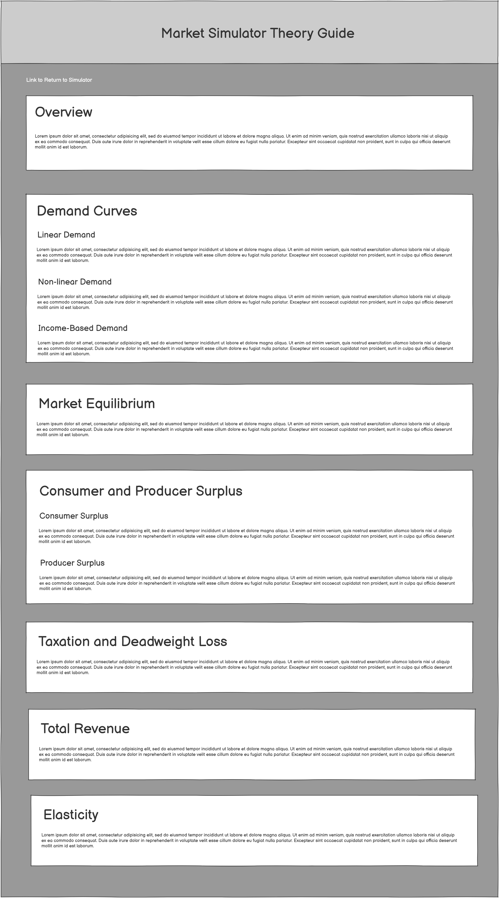
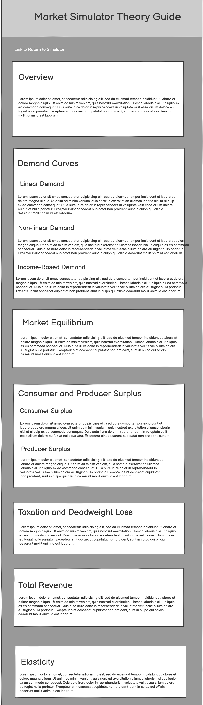
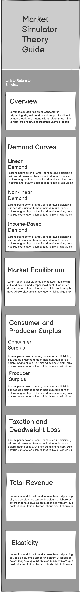
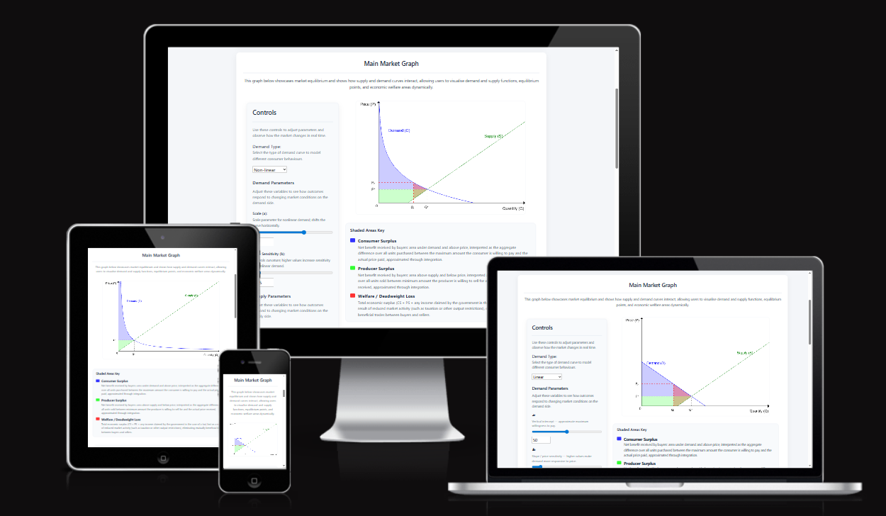
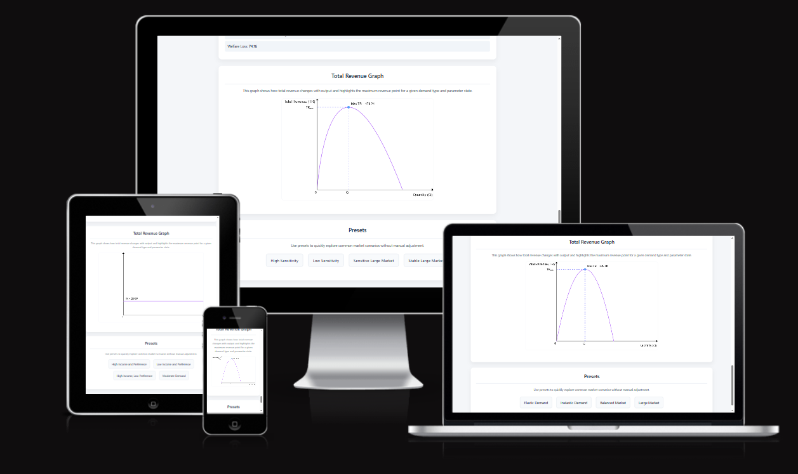
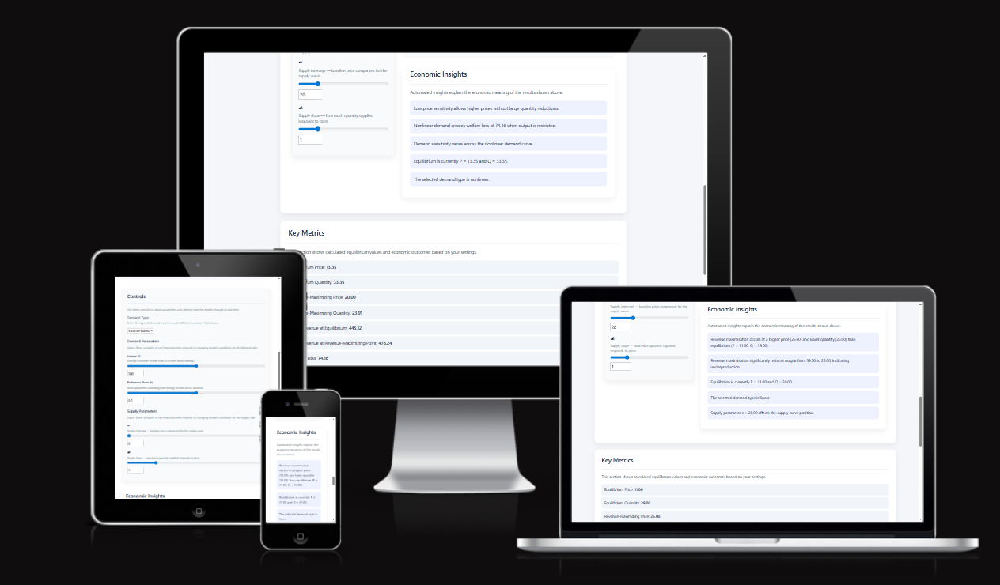
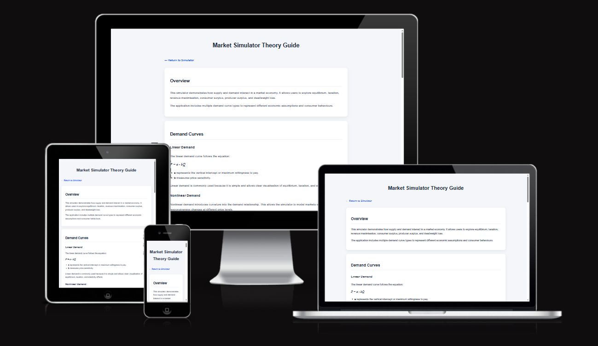
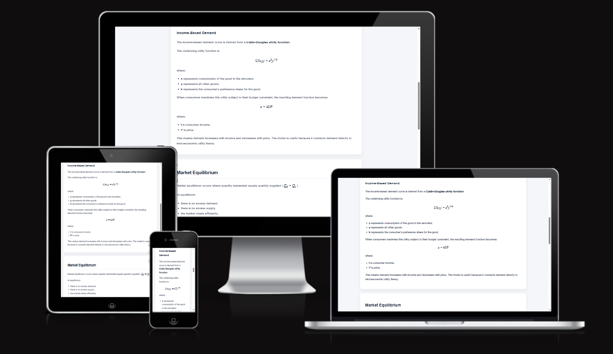
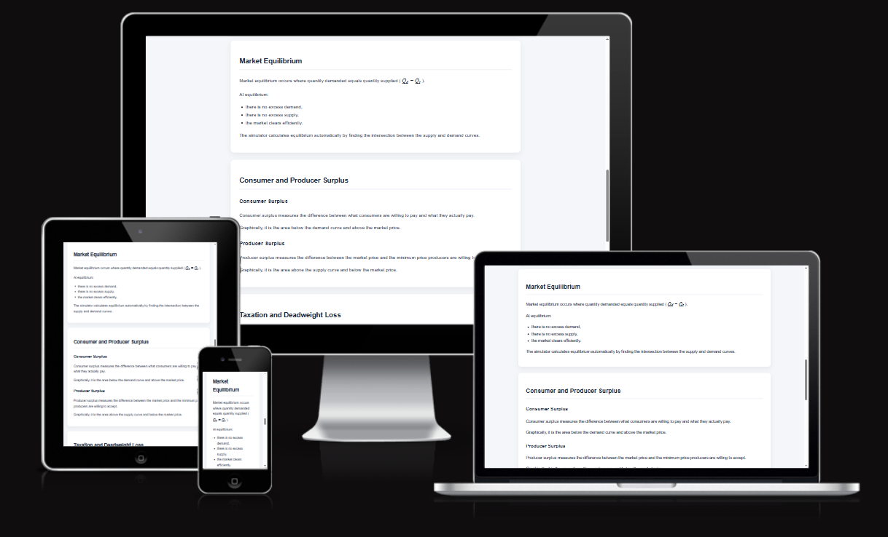
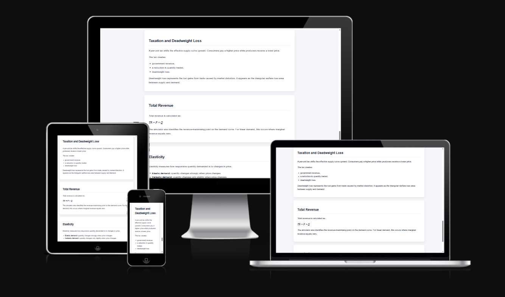

# Market Simulator and Pricing Analysis Application

## Overview

The **Market Simulator and Pricing Analysis Application** is a fully interactive, browser-based economic modelling tool developed as part of the Code Institute Full Stack JavaScript module. The project was designed to move beyond static representations of economic concepts and instead create a system in which users can actively manipulate and observe market behaviour in real time.

Traditional supply and demand diagrams are limited by their static nature. They allow the illustration of relationships, but not experimentation. This application addresses that limitation by introducing a dynamic system where users can directly alter parameters such as demand elasticity, income levels, and taxation, and immediately observe how these changes affect equilibrium, revenue, and welfare.

The application therefore serves both as a **technical demonstration of advanced JavaScript and rendering logic**, and as an **educational tool grounded in economic theory**, enabling the user to transition from passive observation to active exploration.

**Market Simulator Deployed Link:** https://mivic1998.github.io/market-simulator-and-pricing-analysis-application/

---

## Table of Contents

- [Overview](#overview)
- [User Experience (UX)](#user-experience-ux)
  - [User Stories](#user-stories)
- [Design](#design)
- [Colour Palette](#colour-palette)
  - [Light Mode](#light-mode)
  - [Dark Mode](#dark-mode)
- [Wireframes](#wireframes)
  - [Main Application](#main-application)
  - [Theory Page](#theory-page)
- [Features](#features)
  - [Main Market Graph](#main-market-graph)
  - [Revenue Graph and Presets](#revenue-graph-and-presets)
  - [Metrics and Insights (Responsive Layout)](#metrics-and-insights-responsive-layout)
  - [Taxation and Supply Mode](#taxation-and-supply-mode)
  - [Dark Mode](#dark-mode-1)
- [Theory Page (Feature Overview)](#theory-page-1)
- [JavaScript & Application Logic](#javascript--application-logic)
  - [State Management](#state-management)
  - [Reactive Rendering System](#reactive-rendering-system)
  - [Graph Rendering](#graph-rendering)
  - [Demand Models](#demand-models)
- [Responsive Design](#responsive-design)
- [Challenges Encountered](#challenges-encountered)
  - [Full Application Update Cycle](#full-application-update-cycle)
  - [Managing Multiple Application States](#managing-multiple-application-states)
  - [Synchronisation of Inputs](#synchronisation-of-inputs)
  - [Canvas Rendering and Scaling](#canvas-rendering-and-scaling)
  - [Handling Edge Cases](#handling-edge-cases)
  - [Dark Mode and Canvas Rendering](#dark-mode-and-canvas-rendering)
- [AI Tool Usage and Reflection](#ai-tool-usage-and-reflection)
- [Future Improvements](#future-improvements)
- [Technologies Used](#technologies-used)
- [Accessibility](#accessibility)
- [Testing](#testing)
- [Deployment](#deployment)
- [Credits](#credits)

---

## User Experience (UX)

The UX design of the application is centred around three core principles:

1. **Immediate feedback** – changes should be reflected instantly to reinforce learning  
2. **Clarity of structure** – users should not be overwhelmed by complexity  
3. **Progressive exploration** – users can move from basic understanding to more advanced features  

The interface deliberately prioritises the main market graph as the focal point, with supporting panels (controls, metrics, insights) positioned to assist interpretation rather than compete for attention.

---

### User Stories

User stories were used to guide both design decisions and implementation priorities.

#### First-Time Visitors

First-time visitors require immediate clarity and usability. The system is designed so that interaction is intuitive even without prior experience.

- As a first-time visitor, I want to immediately understand the purpose of the application, so that I can begin interacting without needing external explanation  
- As a first-time visitor, I want controls to be clearly labelled and grouped, so that I can quickly identify how to adjust the system  
- As a first-time visitor, I want to see immediate visual changes, so that I can understand cause-and-effect relationships without delay  

---

#### Returning Users

Returning users prioritise efficiency and familiarity.

- As a returning user, I want a consistent interface, so that I can interact quickly without relearning controls  
- As a returning user, I want preset configurations, so that I can test defined economic scenarios without manually setting every parameter  
- As a returning user, I want my display preferences such as dark mode to be retained, so that usability is improved over time  

---

#### Users Exploring Economic Theory

This group represents the core educational goal of the application.

- As a user, I want to manipulate supply and demand, so that I can observe how equilibrium emerges from their interaction  
- As a user, I want to visualise consumer and producer surplus, so that welfare concepts become intuitive rather than abstract  
- As a user, I want to analyse revenue behaviour, so that I can understand how firms choose prices  
- As a user, I want to explore taxation, so that I can identify inefficiencies such as deadweight loss  
- As a user, I want insights explaining results, so that I can interpret the graphs correctly  

---

#### Users on Different Devices

Responsiveness is essential to ensure accessibility.

- As a user on a desktop device, I want a multi-column layout, so that I can interact with the system efficiently  
- As a user on a smaller device, I want content stacked logically, so that usability is not compromised  
- As a user on any device, I want all features to remain accessible, so that functionality is consistent  

---

## Design

The design approach was centred on maintaining a strong relationship between **visual hierarchy and functional importance**.

The market graph is the dominant element of the interface, reflecting its role as the primary output. Supporting elements are visually separated into panels, allowing users to easily distinguish between:

- input (controls)  
- output (graph + metrics)  
- interpretation (insights)  

This separation reduces cognitive load and supports clearer understanding.

---

## Colour Palette

The section below discusses in detail the colour palette choices which were made in order to enhance the usability of the application.

### Light Mode

Below is the colour palette implemented for the application's light mode setting

The light mode palette was designed to maximise readability while maintaining meaningful colour associations. Blue tones are used consistently for demand-related and interactive elements, green is used for supply, and purple is used to represent revenue.

This consistent mapping ensures that users can quickly identify relationships visually without needing to refer to labels repeatedly.

---

### Dark Mode

Below is the colour palette implemented for the application's dark mode setting

Dark mode was not implemented as a simple inversion of colours. Instead, it required a full redesign of the palette to ensure that:

- contrast is preserved  
- graph elements remain distinct  
- readability is maintained  

This was particularly challenging due to the fact that canvas elements do not automatically inherit CSS styling.

---

## Wireframes

In this section the wireframes for both the main application and the accompanying theory page are presented.

### Main Application

Below is the wireframe for the main application page on desktop:

 

Below is the wireframe for the main application page on tablet:

 

Below is the wireframe for the main application page on mobile: 

  

The wireframes illustrate the structural evolution of the interface across device sizes. On desktop, the layout adopts a multi-column approach to maximise efficiency. As screen size decreases, the layout transitions into a vertically stacked structure where the graph remains prioritised and controls follow beneath.

---

### Theory Page

Below is the wireframe for the supplementary theory page on desktop:

   

Below is the wireframe for the supplementary theory page on tablet:

  

Below is the wireframe for the supplementary theory page on mobile: 

 

The theory page was designed differently from the main application, prioritising **content readability rather than interaction**. The layout is intentionally linear, allowing users to scroll through structured sections covering key economic concepts.

---

## Features

Below is a comprehensive detailing of the features that users can explore while using the application.

### Main Market Graph

The main graph is the central feature of the application. It dynamically renders supply and demand curves using the HTML5 Canvas API, based on real-time parameter inputs.

The graph is not pre-drawn or static. Instead, it is generated through mathematical functions that calculate values and convert them into pixel coordinates. This approach allows the application to support multiple demand models, including linear, nonlinear, and income-based demand, each of which produces a different curve shape and behaviour.

As users adjust parameters such as intercepts, slopes, or taxation levels, the graph is recalculated and redrawn instantly. This ensures that the visual output remains fully synchronised with the underlying economic model, allowing users to observe how changes in inputs directly affect equilibrium, surplus, and overall market outcomes.

In addition to plotting curves, the graph also incorporates visual elements such as shaded surplus areas, equilibrium markers, and guide lines. These features help translate abstract calculations into clear visual representations, making it easier for users to interpret results without relying solely on numerical outputs.

---

### Revenue Graph and Presets

The revenue graph (which is displayed only in demand mode) adds a second layer of analysis to the application by showing how total revenue changes as output varies. Unlike the main market graph, which focuses on equilibrium, this graph allows users to explore firm behaviour and identify the output level at which revenue is maximised.

The shape of the revenue curve depends on the selected demand model. Under linear demand, the curve follows a parabolic shape, increasing to a maximum before declining. For nonlinear demand, the curve adjusts according to the exponential relationship, while income-based demand produces constant revenue due to unit elasticity. This ensures the graph remains consistent with the underlying economic model.

The preset system is closely integrated with this graph and allows users to quickly switch between meaningful parameter configurations. Rather than manually adjusting multiple inputs, presets apply predefined values to the central state, instantly updating both the market and revenue graphs.

Presets vary depending on both the **selected demand type** and the **current mode of the application**. In demand mode, presets are designed to highlight differences such as elastic versus inelastic demand, as well as changes in intercepts and curve shapes. In supply mode, presets also include taxation, allowing users to observe how different combinations of demand conditions and tax levels affect revenue outcomes.

Because presets modify multiple variables at once, they are particularly useful for comparing scenarios. For example, users can quickly observe how revenue behaviour differs between elastic and inelastic demand, or how taxation impacts total revenue under different market conditions. This makes the preset system an important tool for structured experimentation rather than just convenience.

---

### Metrics and Insights (Responsive Layout)

The metrics panel presents key numerical outputs such as equilibrium price and quantity, while the insights panel provides contextual explanations that help interpret these results in economic terms.

The inclusion of both quantitative and qualitative outputs ensures that users are not only able to observe changes in the model, but also understand their significance. The insights system translates variations in parameters into explanations related to elasticity, welfare effects, and market behaviour, reducing the need for prior theoretical knowledge.

The responsive behaviour shown in the image is deliberately selected to highlight differences across smaller screen sizes. On mobile devices, the layout already demonstrates how the insights section is positioned beneath the graph in a fully stacked format, ensuring readability and preserving the hierarchy of information.

To avoid repetition of this same stacked layout, the screenshot instead focuses on the tablet view, where the control panel is also visible. This allows the documentation to illustrate how controls are adapted at intermediate screen sizes without duplicating the mobile presentation. In this way, the image captures both the vertical stacking of interpretation elements on smaller screens and the transitional layout where interaction panels remain partially visible alongside outputs.

---

### Taxation and Supply Mode

Supply mode introduces taxation by shifting the supply curve upwards, creating a wedge between the price paid by consumers and the price received by producers.

The graph highlights both tax revenue and deadweight loss, allowing users to visually understand the inefficiencies created by market intervention. The reduction in equilibrium quantity, alongside the emergence of a deadweight loss area, demonstrates how taxation disrupts mutually beneficial trades between buyers and sellers.

The responsive display shown in the image also showcases different demand curve types across device layouts. Each screen presents a slightly different demand model, illustrating how taxation interacts with various demand conditions. For example, the impact of a given tax differs depending on whether demand is more elastic or inelastic, which is reflected in both the magnitude of the reduction in quantity and the size of the deadweight loss.

This variation reinforces an important economic insight: the burden and efficiency cost of taxation are not fixed, but depend on the underlying responsiveness of consumers. By combining taxation with multiple demand models, the application allows users to directly compare how different market conditions influence the outcomes of government intervention.

---

## Dark Mode

A fully integrated dark mode is included to improve usability in low-light environments and reduce eye strain. The colour palette was redesigned rather than simply inverted, ensuring that all elements — particularly canvas-rendered graphs — maintain clear contrast and readability.  

Special consideration was required for graph rendering, as canvas elements do not automatically inherit CSS styling. As a result, colours for curves, labels, and shading were dynamically adjusted to ensure visibility across both light and dark themes, while preserving consistent meaning (e.g. demand, supply, and revenue colours).

### Theory Page

Now we turn our attention to the theory page, describing both its content and its layout which is presented in the following images.

The following view introduces the overall structure of the theory page, outlining the core concepts and establishing the foundation for understanding how demand is represented within the application.

The section in the following image develops more advanced material, including income-based demand and its mathematical formulation, linking directly to the models implemented within the simulator

This view focuses on equilibrium and welfare analysis, explaining how consumer surplus, producer surplus, and market efficiency are determined and visualised in the application.

 

This final section extends the analysis to taxation and market distortion, demonstrating how concepts such as deadweight loss and government intervention are introduced and connected to the supply-side functionality of the simulator.

The theory page supports the application by providing structured explanations of key concepts, including demand models, equilibrium, and welfare.

It bridges the gap between the mathematical logic implemented in the application and the conceptual understanding required by users.

---

## JavaScript & Application Logic

The application is driven by a **centralised state-based architecture**, implemented entirely in vanilla JavaScript.

### State Management

All key variables are stored in a single state object, which acts as the authoritative source of truth. This includes parameters such as demand type, supply characteristics, and taxation levels.

By centralising state, the application ensures consistency across all components, reducing the risk of desynchronisation between inputs and outputs.

---

### Reactive Rendering System

The system operates as a manual reactive architecture. Every user interaction follows a defined sequence:

1. The state is updated  
2. New values are calculated based on that state  
3. The graph is cleared and redrawn  
4. Metrics are recalculated and displayed  
5. Insights are regenerated  

This ensures that the entire application remains in sync at all times.

---

### Graph Rendering

Graph rendering is handled using the Canvas API. This introduces significant complexity, as it requires:

- converting mathematical equations into coordinate points  
- scaling values dynamically to fit the canvas  
- handling multiple curve types  

Unlike using a charting library, this approach required full manual implementation, offering greater flexibility but increasing difficulty.

---

### Demand Models

The application supports three demand models:

- linear demand  
- nonlinear demand  
- income-based demand  

Each model requires its own calculation and rendering logic, increasing the overall complexity of the system.

---

## Responsive Design

Responsive design was implemented using a combination of Bootstrap grid structures and custom media queries, but the process extended far beyond simple layout adjustments.

The primary challenge was maintaining usability across devices **without compromising the functionality of the graphs**, which are the central component of the application.

On larger screens, a multi-column layout is used, allowing the graph and controls to be displayed simultaneously. This supports efficient interaction, as users can immediately adjust parameters while observing the graph.

As the screen size decreases, the layout transitions into a vertical structure. The graph is always positioned first, followed by controls and outputs. This ensures that the most important element remains accessible while maintaining logical flow.

Additional considerations included:
- resizing canvas elements without distorting data  
- ensuring controls remain usable on touch devices  
- maintaining visual hierarchy across layouts  

These adjustments required extensive testing and refinement, as small layout changes could quickly impact usability.

---

## Challenges Encountered

The development of this application presented a range of technical challenges, primarily due to the number of interconnected systems and the need to maintain consistency across all user interactions. The application is not composed of isolated components; instead, every element is linked through a shared state, meaning that even small interactions trigger wide-ranging updates.

---

### Full Application Update Cycle

One of the most significant challenges was managing the fact that the entire application must update whenever a user interacts with it. Any change — whether adjusting a slider, entering a value manually, switching demand type, or changing mode — requires a full recalculation and redraw of:

- the main market graph  
- the revenue graph  
- all calculated metrics  
- the insights panel  

This creates a dependency chain where every interaction must correctly propagate through the system. If any part of this update sequence fails or is out of sync, the application produces inconsistent or incorrect results.

Ensuring that all components updated in the correct order and remained synchronised required careful structuring of the update logic and repeated debugging.

---

### Managing Multiple Application States

The application operates across several overlapping states, including:

- demand vs supply mode  
- three different demand models  
- taxation levels  
- preset configurations  

Each of these states influences how calculations are performed and how graphs are rendered. For example, switching demand types changes the underlying mathematical model, while switching to supply mode introduces taxation and additional calculations.

Handling transitions between these states was particularly challenging, as logic that worked in one configuration could fail in another. This required extensive conditional handling and careful separation of logic for each scenario.

---

### Synchronisation of Inputs

Another major challenge was ensuring that all user inputs remained synchronised. The application allows variables to be changed through:

- range sliders  
- number input fields  
- preset buttons  

All of these inputs modify the same underlying variables in the application state. This creates the risk of desynchronisation, where one input updates but others do not reflect the change.

To address this, each input is tightly linked to the central state, and every update triggers a refresh across all related inputs. This ensures that sliders, number fields, and presets remain consistent at all times, but required precise event handling and careful debugging.

---

### Canvas Rendering and Scaling

Rendering graphs using the Canvas API introduced significant complexity, as all drawing operations had to be implemented manually. This included:

- converting mathematical functions into coordinate points  
- scaling values to fit within the canvas  
- redrawing curves dynamically as parameters change  

Unlike using a charting library, there was no abstraction layer to handle these tasks automatically. Small errors in scaling or coordinate mapping could lead to visibly incorrect graphs, making this one of the most technically demanding aspects of the project.

---

### Handling Edge Cases

Certain parameter combinations introduced edge cases that could break the application or produce invalid graphs. Examples included:

- extremely steep or near-vertical curves  
- zero or near-zero prices  
- very large or very small parameter values  

These cases required additional conditional logic to ensure stability and prevent rendering errors.

---

### Dark Mode and Canvas Rendering

Implementing dark mode introduced additional challenges, particularly because canvas elements do not inherit CSS styles. All colours used within the graphs had to be manually adjusted to ensure they remained visible against darker backgrounds.

This required duplicating certain rendering logic and carefully testing contrast across both light and dark modes.

---

Overall, the primary challenge of the project was not implementing individual features, but ensuring that all features remained consistent and synchronised within a highly interactive, state-driven system. The complexity arose from how each component depended on every other component, requiring careful coordination of logic, rendering, and user interaction.

---

## AI Tool Usage and Reflection

Artificial intelligence tools were used throughout the development process to support problem solving, particularly in areas where there was no prior experience. One of the most significant examples of this was the implementation of canvas-based graph rendering, which introduced a completely new set of challenges compared to standard DOM-based development.

At the start of the project, there was no prior experience with the HTML5 Canvas API or with translating mathematical functions into graphical output. Concepts such as coordinate mapping, scaling functions to fit a fixed canvas, and dynamically redrawing curves in response to user interaction required a different approach to problem solving. AI was used in this context to help break down these unfamiliar problems into manageable steps, suggest approaches to mapping values to pixels, and identify potential sources of error when graphs were not rendering correctly.

However, AI output was rarely used directly. In many cases, suggestions needed to be critically evaluated, simplified, or significantly modified to fit the structure of the application. This was particularly true when dealing with the interaction between multiple systems, such as ensuring that canvas rendering remained consistent with the central state object and updated correctly when parameters changed.

The collaborative process highlighted the importance of understanding, rather than simply applying, generated solutions. AI often provided a starting point or a direction, but achieving a working implementation required manual refinement and testing. In some cases, suggested approaches did not integrate well with the existing codebase and had to be reworked or discarded entirely.

This process was especially valuable in developing an understanding of canvas rendering logic. By working through suggestions, debugging issues, and adapting solutions, it was possible to build a functioning system that accurately represents economic models visually. This represents a significant progression from having no initial experience with canvas to implementing a fully dynamic graphing system.

Overall, AI functioned as a support tool for exploration and debugging rather than a replacement for problem solving. The final application reflects independently implemented logic, with AI contributing primarily to accelerating the learning process and helping navigate unfamiliar technical challenges.

## Future Improvements

While the application is fully functional, there are several areas where it could be extended or refined to improve both maintainability and user experience.

One potential improvement is the modularisation of the JavaScript codebase. At present, most logic is contained within a single file, which makes it harder to manage as complexity increases. Separating functionality into smaller, focused modules (for example, graph rendering, state management, and insights generation) would improve readability, maintainability, and scalability.

The addition of animation could further enhance the user experience. Currently, changes to graphs occur instantly, which prioritises responsiveness but can feel abrupt. Introducing smooth transitions when parameters change would make the behaviour of curves and equilibrium points easier to follow visually.

Expanding the range of economic models would also add depth to the application. While multiple demand models are already supported, further extensions could include more advanced supply models or additional market structures, allowing for a broader exploration of economic theory.

Finally, accessibility improvements could be made to ensure the application is usable by a wider range of users. This could include enhancements such as improved keyboard navigation, more detailed labels for screen readers, and further refinement of contrast levels, particularly within the canvas-rendered graphs.
 
---

## Technologies Used

- HTML5  
- CSS3  
- JavaScript  
- Bootstrap  
- Canvas API  

---

## Accessibility

- Clear visual contrast between elements, including support for dark mode
- Semantic HTML structure to improve readability and assistive technology support  
- Responsive layout ensuring usability across desktop, tablet, and mobile devices  
- Labels and structured controls to make user inputs clear

## Testing

Full testing and validation results can be found in the [TESTING.md](TESTING.md) file.

---

## Deployment

The project was deployed using **GitHub Pages** from the main branch.

---

## Credits

- Color palette generated using Coolors 
- Wireframes generated manually using Balsamiq  
- Open-Meteo API was used to retrieve real-time weather data via geolocation 
- Microsoft Copilot Chat was used as a supporting development tool for debugging and exploring solutions 