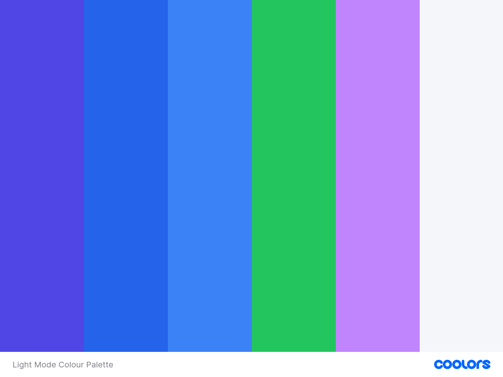
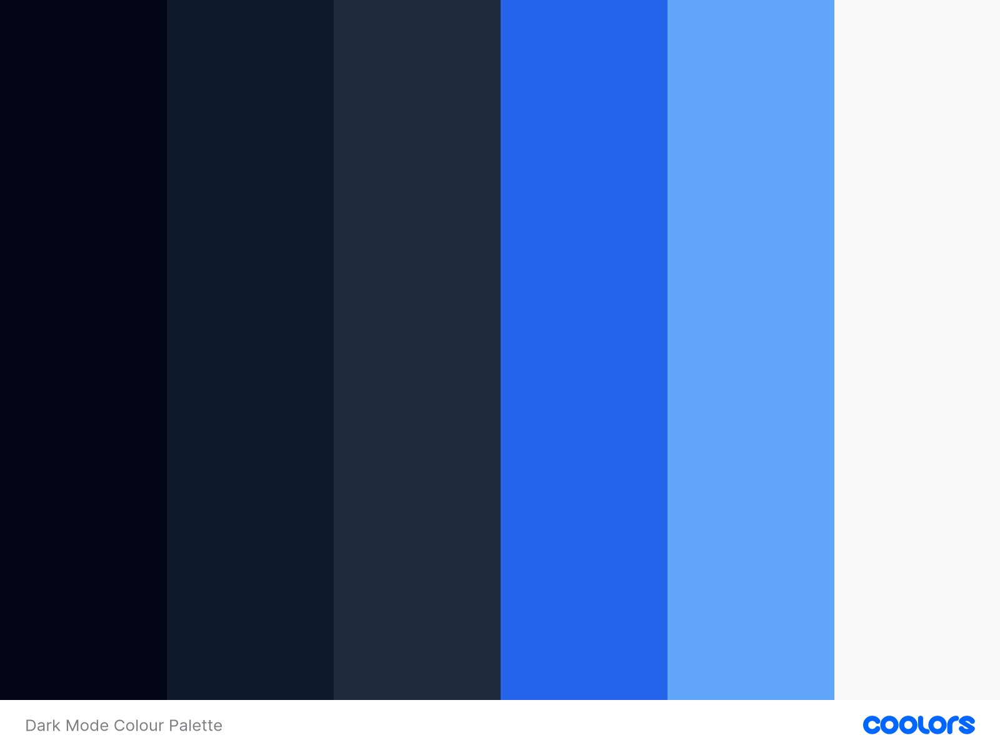
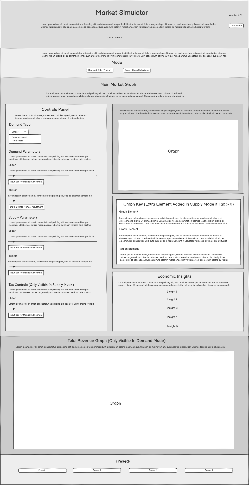
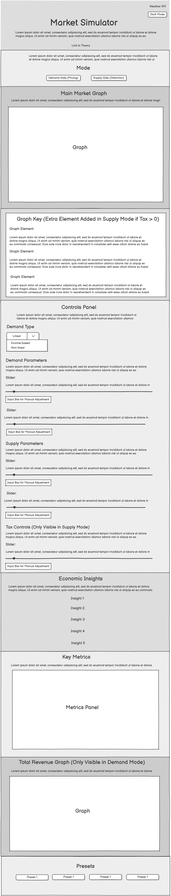

# Market Simulator and Pricing Analysis Application

## Overview

The **Market Simulator and Pricing Analysis Application** is a fully interactive, browser-based economic modelling tool developed as part of the Code Institute Full Stack JavaScript module. The project was designed to move beyond static representations of economic concepts and instead create a system in which users can actively manipulate and observe market behaviour in real time.

Traditional supply and demand diagrams are limited by their static nature. They allow the illustration of relationships, but not experimentation. This application addresses that limitation by introducing a dynamic system where users can directly alter parameters such as demand elasticity, income levels, and taxation, and immediately observe how these changes affect equilibrium, revenue, and welfare.

The application therefore serves both as a **technical demonstration of advanced JavaScript and rendering logic**, and as an **educational tool grounded in economic theory**, enabling the user to transition from passive observation to active exploration.

**Market Simulator Deployed Link:** https://mivic1998.github.io/market-simulator-and-pricing-analysis-application/

---

## User Experience (UX)

The UX design of the application is centred around three core principles:

1. **Immediate feedback** – changes should be reflected instantly to reinforce learning  
2. **Clarity of structure** – users should not be overwhelmed by complexity  
3. **Progressive exploration** – users can move from basic understanding to more advanced features  

The interface deliberately prioritises the main market graph as the focal point, with supporting panels (controls, metrics, insights) positioned to assist interpretation rather than compete for attention.

---

### User Stories

User stories were used to guide both design decisions and implementation priorities.

#### First-Time Visitors

First-time visitors require immediate clarity and usability. The system is designed so that interaction is intuitive even without prior experience.

- As a first-time visitor, I want to immediately understand the purpose of the application, so that I can begin interacting without needing external explanation  
- As a first-time visitor, I want controls to be clearly labelled and grouped, so that I can quickly identify how to adjust the system  
- As a first-time visitor, I want to see immediate visual changes, so that I can understand cause-and-effect relationships without delay  

---

#### Returning Users

Returning users prioritise efficiency and familiarity.

- As a returning user, I want a consistent interface, so that I can interact quickly without relearning controls  
- As a returning user, I want preset configurations, so that I can test defined economic scenarios without manually setting every parameter  
- As a returning user, I want my display preferences such as dark mode to be retained, so that usability is improved over time  

---

#### Users Exploring Economic Theory

This group represents the core educational goal of the application.

- As a user, I want to manipulate supply and demand, so that I can observe how equilibrium emerges from their interaction  
- As a user, I want to visualise consumer and producer surplus, so that welfare concepts become intuitive rather than abstract  
- As a user, I want to analyse revenue behaviour, so that I can understand how firms choose prices  
- As a user, I want to explore taxation, so that I can identify inefficiencies such as deadweight loss  
- As a user, I want insights explaining results, so that I can interpret the graphs correctly  

---

#### Users on Different Devices

Responsiveness is essential to ensure accessibility.

- As a user on a desktop device, I want a multi-column layout, so that I can interact with the system efficiently  
- As a user on a smaller device, I want content stacked logically, so that usability is not compromised  
- As a user on any device, I want all features to remain accessible, so that functionality is consistent  

---

## Design

The design approach was centred on maintaining a strong relationship between **visual hierarchy and functional importance**.

The market graph is the dominant element of the interface, reflecting its role as the primary output. Supporting elements are visually separated into panels, allowing users to easily distinguish between:

- input (controls)  
- output (graph + metrics)  
- interpretation (insights)  

This separation reduces cognitive load and supports clearer understanding.

---

## Colour Palette

### Light Mode

The light mode palette was designed to maximise readability while maintaining meaningful colour associations. Blue tones are used consistently for demand-related and interactive elements, green is used for supply, and purple is used to represent revenue.

This consistent mapping ensures that users can quickly identify relationships visually without needing to refer to labels repeatedly.

---

### Dark Mode

Dark mode was not implemented as a simple inversion of colours. Instead, it required a full redesign of the palette to ensure that:

- contrast is preserved  
- graph elements remain distinct  
- readability is maintained  

This was particularly challenging due to the fact that canvas elements do not automatically inherit CSS styling.

---

## Wireframes

In this section the wireframes for both the main application and the accompanying theory page are presented.

### Main Application

Below is the wireframe for the main application page on desktop:

 

Below is the wireframe for the main application page on tablet:

 

Below is the wireframe for the main application page on mobile: 

  

The wireframes illustrate the structural evolution of the interface across device sizes. On desktop, the layout adopts a multi-column approach to maximise efficiency. As screen size decreases, the layout transitions into a vertically stacked structure where the graph remains prioritised and controls follow beneath.

---

### Theory Page

assets/images/readme/theory-wireframe-desktop.png  
assets/images/readme/theory-wireframe-tablet.png  
assets/images/readme/theory-wireframe-mobile.png  

The theory page was designed differently from the main application, prioritising **content readability rather than interaction**. The layout is intentionally linear, allowing users to scroll through structured sections covering key economic concepts.

---

## Features

### Main Market Graph

assets/images/readme/main-responsive-view-three-demand-mode.PNG

The main graph is the central feature of the application. It dynamically renders supply and demand curves using the HTML5 Canvas API, based on real-time parameter inputs.

The graph is not pre-drawn or static. Instead, it is generated through mathematical functions that calculate values and convert them into pixel coordinates. This allows the system to support multiple demand models and continuously adjust to user input.

---

### Revenue Graph

assets/images/readme/main-responsive-view-five-demand-mode.PNG

The revenue graph introduces a second analytical layer. It demonstrates how total revenue changes with output and identifies the revenue-maximising point.

This allows users to explore the distinction between competitive equilibrium and profit-maximising behaviour, which is a key concept in microeconomics.

---

### Metrics and Insights

assets/images/readme/main-responsive-view-four-demand-mode.PNG

The metrics panel provides numerical outputs, such as equilibrium price and quantity, while the insights panel interprets those values.

The combination of quantitative and qualitative outputs ensures that users not only see results, but also understand them.

---

### Taxation and Supply Mode

assets/images/readme/main-responsive-view-supply-mode.PNG

Supply mode introduces taxation, which shifts the supply curve and creates a wedge between the price paid by consumers and the price received by producers.

The graph highlights tax revenue and deadweight loss, allowing users to visualise inefficiencies caused by market intervention.

---

### Theory Page

assets/images/readme/theory-responsive-view-one.PNG  
assets/images/readme/theory-responsive-view-two.PNG  
assets/images/readme/theory-responsive-view-three.PNG  

The theory page supports the application by providing structured explanations of key concepts, including demand models, equilibrium, and welfare.

It bridges the gap between the mathematical logic implemented in the application and the conceptual understanding required by users.

---

## JavaScript & Application Logic

The application is driven by a **centralised state-based architecture**, implemented entirely in vanilla JavaScript.

### State Management

All key variables are stored in a single state object, which acts as the authoritative source of truth. This includes parameters such as demand type, supply characteristics, and taxation levels.

By centralising state, the application ensures consistency across all components, reducing the risk of desynchronisation between inputs and outputs.

---

### Reactive Rendering System

The system operates as a manual reactive architecture. Every user interaction follows a defined sequence:

1. The state is updated  
2. New values are calculated based on that state  
3. The graph is cleared and redrawn  
4. Metrics are recalculated and displayed  
5. Insights are regenerated  

This ensures that the entire application remains in sync at all times.

---

### Graph Rendering

Graph rendering is handled using the Canvas API. This introduces significant complexity, as it requires:

- converting mathematical equations into coordinate points  
- scaling values dynamically to fit the canvas  
- handling multiple curve types  

Unlike using a charting library, this approach required full manual implementation, offering greater flexibility but increasing difficulty.

---

### Demand Models

The application supports three demand models:

- linear demand  
- nonlinear demand  
- income-based demand  

Each model requires its own calculation and rendering logic, increasing the overall complexity of the system.

---

## Responsive Design

Responsive design was implemented using a combination of Bootstrap grid structures and custom media queries, but the process extended far beyond simple layout adjustments.

The primary challenge was maintaining usability across devices **without compromising the functionality of the graphs**, which are the central component of the application.

On larger screens, a multi-column layout is used, allowing the graph and controls to be displayed simultaneously. This supports efficient interaction, as users can immediately adjust parameters while observing the graph.

As the screen size decreases, the layout transitions into a vertical structure. The graph is always positioned first, followed by controls and outputs. This ensures that the most important element remains accessible while maintaining logical flow.

Additional considerations included:
- resizing canvas elements without distorting data  
- ensuring controls remain usable on touch devices  
- maintaining visual hierarchy across layouts  

These adjustments required extensive testing and refinement, as small layout changes could quickly impact usability.

---

## Challenges Encountered

### Canvas Rendering Complexity

One of the most significant challenges was translating mathematical functions into visual representations. Unlike pre-built libraries, the Canvas API required manual implementation of scaling, plotting, and drawing logic. Even small miscalculations could result in incorrect graphs.

---

### Managing Multiple Application States

The application operates across multiple overlapping states, including demand type selection, mode switching (demand vs supply), and parameter adjustments. Ensuring consistency across all combinations required careful structuring and testing.

---

### Synchronisation of Inputs

The system allows users to interact through sliders, number inputs, and presets. Ensuring that all of these inputs updated the same underlying state without conflict required precise event handling and careful design.

---

### Edge Case Handling

Certain economic scenarios introduced edge cases that could break the graph, such as vertical curves or extreme parameter values. These required additional conditional logic to ensure stability.

---

### Dark Mode Integration

Implementing dark mode introduced unexpected challenges, particularly with canvas rendering. Since canvas elements do not inherit CSS styles automatically, all colours had to be handled manually to ensure visibility.

---

## Future Improvements

While the application is fully functional, there are several potential improvements:

- modularising JavaScript into separate files  
- adding animation for smoother transitions  
- expanding economic models  
- improving accessibility features  

---

## Technologies Used

- HTML5  
- CSS3  
- JavaScript  
- Bootstrap  
- Canvas API  

---

## Credits

- Code Institute  
- Bootstrap  
- Open-Meteo API  