# Market Simulator and Pricing Analysis Application

## Overview

The **Market Simulator and Pricing Analysis Application** is a fully interactive, browser-based economic modelling tool developed as part of the Code Institute Full Stack JavaScript module. The project was designed to move beyond static representations of economic concepts and instead create a system in which users can actively manipulate and observe market behaviour in real time.

Traditional supply and demand diagrams are limited by their static nature. They allow the illustration of relationships, but not experimentation. This application addresses that limitation by introducing a dynamic system where users can directly alter parameters such as demand elasticity, income levels, and taxation, and immediately observe how these changes affect equilibrium, revenue, and welfare.

The application therefore serves both as a **technical demonstration of advanced JavaScript and rendering logic**, and as an **educational tool grounded in economic theory**, enabling the user to transition from passive observation to active exploration.

**Market Simulator Deployed Link:** https://mivic1998.github.io/market-simulator-and-pricing-analysis-application/

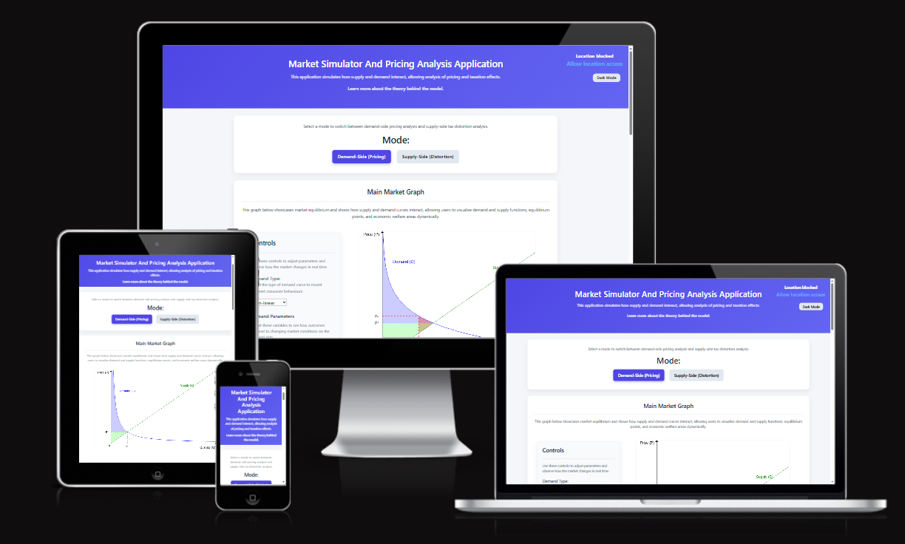

---

## Table of Contents

- [Overview](#overview)

- [User Experience (UX)](#user-experience-ux)
  - [User Stories](#user-stories)
    - [First-Time Visitors](#first-time-visitors)
    - [Returning Users](#returning-users)
    - [Users Exploring Economic Theory](#users-exploring-economic-theory)
    - [Users on Different Devices](#users-on-different-devices)

- [Design](#design)

- [Colour Palette](#colour-palette)
  - [Light Mode](#light-mode)
  - [Dark Mode](#dark-mode)

- [Wireframes](#wireframes)
  - [Main Application](#main-application)
  - [Theory Page](#theory-page)

- [Features](#features)
  - [Main Market Graph](#main-market-graph)
  - [Revenue Graph and Presets](#revenue-graph-and-presets)
  - [Metrics and Insights (Responsive Layout)](#metrics-and-insights-responsive-layout)
  - [Taxation and Supply Mode](#taxation-and-supply-mode)
  - [Dark Mode](#dark-mode-1)
  - [Theory Page](#theory-page)

- [JavaScript Application Architecture](#javascript-application-architecture)
  - [State Management](#state-management)
  - [Mode System](#mode-system)
  - [Demand Type System](#demand-type-system)
  - [Dynamic Parameter Mapping](#dynamic-parameter-mapping)
  - [Preset Visibility System](#preset-visibility-system)
  - [Economic Calculations](#economic-calculations)
  - [Main Graph Rendering](#main-graph-rendering)
  - [Welfare Shading](#welfare-shading)
  - [Revenue Graph](#revenue-graph)
  - [Hover System](#hover-system)
  - [Insight Generation](#insight-generation)
  - [Preset System](#preset-system)
  - [Dark Mode Implementation](#dark-mode-implementation)
  - [Session Storage for Theme Persistence](#session-storage-for-theme-persistence)
  - [Canvas Theme Handling](#canvas-theme-handling)
  - [Overall Flow](#overall-flow)

- [Challenges Encountered](#challenges-encountered)
  - [Full Application Update Cycle](#full-application-update-cycle)
  - [Managing Multiple Application States](#managing-multiple-application-states)
  - [Synchronisation of Inputs](#synchronisation-of-inputs)
  - [Canvas Rendering and Scaling](#canvas-rendering-and-scaling)
  - [Handling Edge Cases](#handling-edge-cases)
  - [Dark Mode and Canvas Rendering](#dark-mode-and-canvas-rendering)

- [AI Tool Usage and Reflection](#ai-tool-usage-and-reflection)

- [Future Improvements](#future-improvements)

- [Technologies Used](#technologies-used)

- [Accessibility](#accessibility)

- [Testing](#testing)

- [Deployment](#deployment)

- [Credits](#credits)

---

## User Experience (UX)

The UX design of the application is centred around three core principles:

1. **Immediate feedback** – changes should be reflected instantly to reinforce learning  
2. **Clarity of structure** – users should not be overwhelmed by complexity  
3. **Progressive exploration** – users can move from basic understanding to more advanced features  

The interface deliberately prioritises the main market graph as the focal point, with supporting panels (controls, metrics, insights) positioned to assist interpretation rather than compete for attention.

---

### User Stories

User stories were used to guide both design decisions and implementation priorities.

#### First-Time Visitors

First-time visitors require immediate clarity and usability. The system is designed so that interaction is intuitive even without prior experience.

- As a first-time visitor, I want to immediately understand the purpose of the application, so that I can begin interacting without needing external explanation  
- As a first-time visitor, I want controls to be clearly labelled and grouped, so that I can quickly identify how to adjust the system  
- As a first-time visitor, I want to see immediate visual changes, so that I can understand cause-and-effect relationships without delay  

---

#### Returning Users

Returning users prioritise efficiency and familiarity.

- As a returning user, I want a consistent interface, so that I can interact quickly without relearning controls  
- As a returning user, I want preset configurations, so that I can test defined economic scenarios without manually setting every parameter  
- As a returning user, I want my display preferences such as dark mode to be retained, so that usability is improved over time  

---

#### Users Exploring Economic Theory

This group represents the core educational goal of the application.

- As a user, I want to manipulate supply and demand, so that I can observe how equilibrium emerges from their interaction  
- As a user, I want to visualise consumer and producer surplus, so that welfare concepts become intuitive rather than abstract  
- As a user, I want to analyse revenue behaviour, so that I can understand how firms choose prices  
- As a user, I want to explore taxation, so that I can identify inefficiencies such as deadweight loss  
- As a user, I want insights explaining results, so that I can interpret the graphs correctly  

---

#### Users on Different Devices

Responsiveness is essential to ensure accessibility.

- As a user on a desktop device, I want a multi-column layout, so that I can interact with the system efficiently  
- As a user on a smaller device, I want content stacked logically, so that usability is not compromised  
- As a user on any device, I want all features to remain accessible, so that functionality is consistent  

---

## Design

The design approach was centred on maintaining a strong relationship between **visual hierarchy and functional importance**.

The market graph is the dominant element of the interface, reflecting its role as the primary output. Supporting elements are visually separated into panels, allowing users to easily distinguish between:

- input (controls)  
- output (graph + metrics)  
- interpretation (insights)  

This separation reduces cognitive load and supports clearer understanding.

---

## Colour Palette

The section below discusses in detail the colour palette choices which were made in order to enhance the usability of the application.

### Light Mode

Below is the colour palette implemented for the application's light mode setting

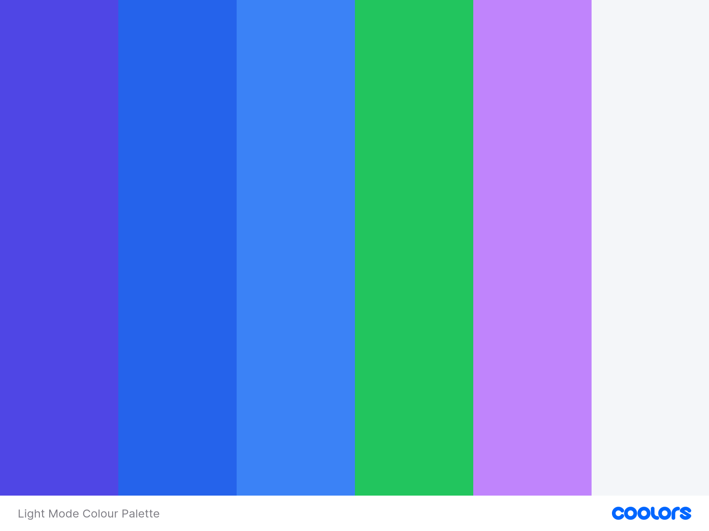

The light mode palette was designed to maximise readability while maintaining meaningful colour associations. Blue tones are used consistently for demand-related and interactive elements, green is used for supply, and purple is used to represent revenue.

The following key colours were used:

- **Primary (Header / Interactive):** `#4f46e5`  
- **Secondary Accent:** `#6366f1`  
- **Background:** `#f4f6f9`  
- **Surface (Cards / Panels):** `#ffffff`  
- **Text (Primary):** `#1e293b`  
- **Text (Secondary):** `#475569`  
- **Muted Text:** `#64748b`  
- **Borders:** `#e2e8f0`  
- **Controls Background:** `#f8fafc`  
- **Metrics Background:** `#f1f5f9`  
- **Insights Background:** `#eef2ff`  
- **Highlight (e.g. temperature / accents):** `#60a5fa`  

This consistent mapping ensures that users can quickly identify relationships visually without needing to refer to labels repeatedly.

---

### Dark Mode

Below is the colour palette implemented for the application's dark mode setting

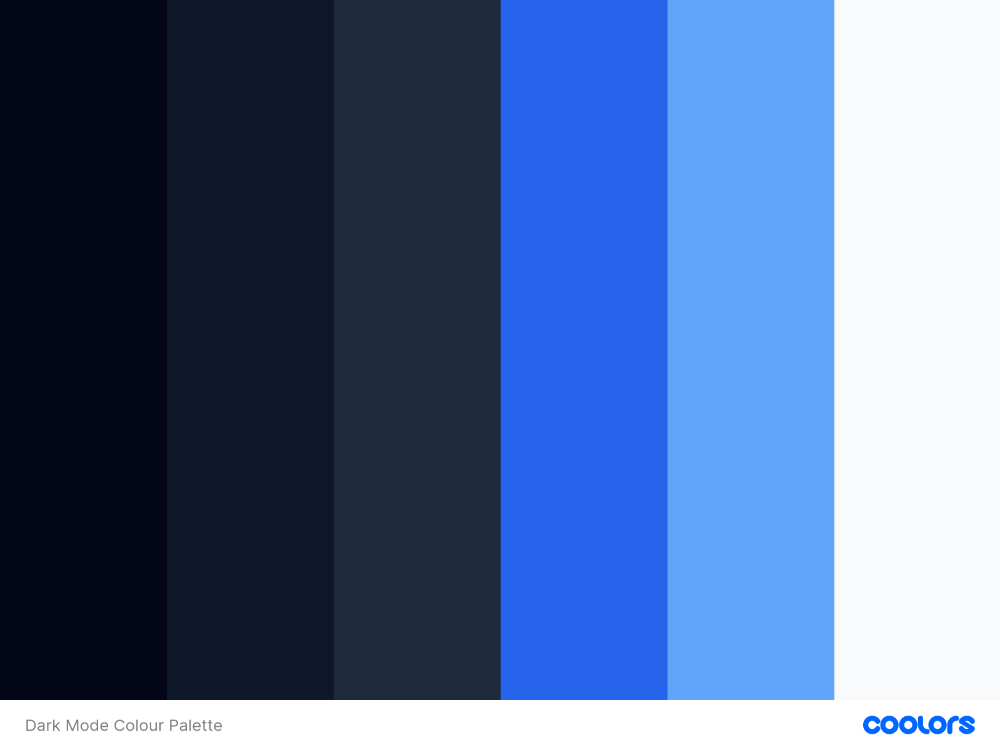

Dark mode was not implemented as a simple inversion of colours. Instead, it required a full redesign of the palette to ensure that:

- contrast is preserved  
- graph elements remain distinct  
- readability is maintained  

The following colours were used:

- **Background:** `#020617`  
- **Surface / Panels (Gradient):** `#0f172a → #111827`  
- **Card / Metric Background:** `#111827`  
- **Text (Primary):** `#f8fafc`  
- **Text (Secondary):** `#cbd5e1`  
- **Borders:** `#334155`  

#### Data & Semantic Colours
- **Demand (Blue/Purple tone):** `#818cf8`  
- **Supply (Green):** `#4ade80`  
- **Tax (Yellow):** `#facc15`  
- **Highlight / Key Values:** `#60a5fa`  

#### Interactive Elements
- **Buttons (Default):** `#1e293b`  
- **Buttons (Hover):** `#334155`  
- **Active Button:** `#2563eb`  
- **Active Border Accent:** `#60a5fa`  

#### Additional Elements
- **Canvas Background:** `#020617`  
- **Slider Accent:** `#818cf8`  

This adaptation was particularly challenging due to the fact that canvas elements do not automatically inherit CSS styling, requiring manual synchronisation of chart colours with the UI theme.

---

## Wireframes

In this section the wireframes for both the main application and the accompanying theory page are presented.

### Main Application

Below is the wireframe for the main application page on desktop:

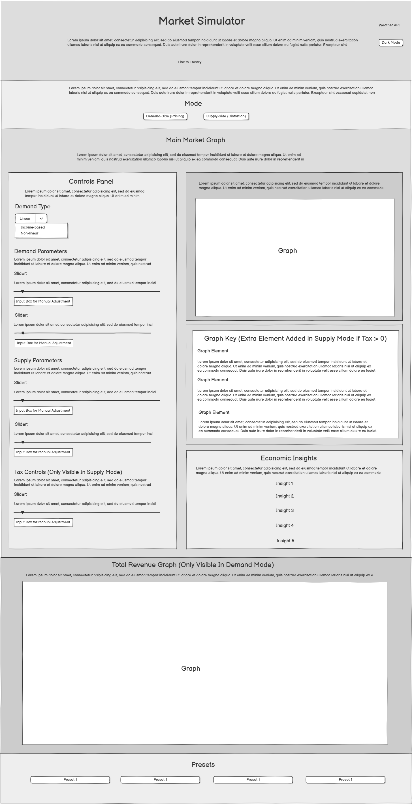 

Below is the wireframe for the main application page on tablet:

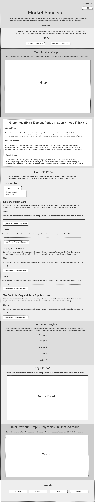 

Below is the wireframe for the main application page on mobile: 

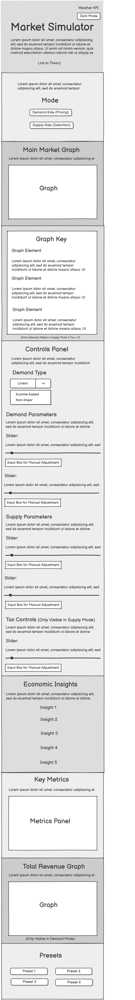  

The wireframes illustrate the structural evolution of the interface across device sizes. On desktop, the layout adopts a multi-column approach to maximise efficiency. As screen size decreases, the layout transitions into a vertically stacked structure where the graph remains prioritised and controls follow beneath.

---

### Theory Page

Below is the wireframe for the supplementary theory page on desktop:

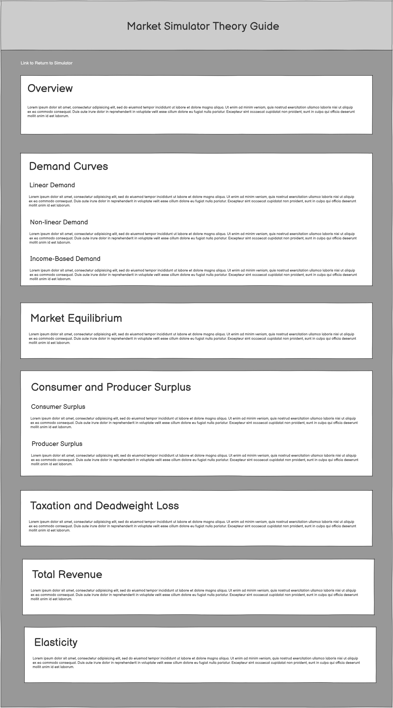   

Below is the wireframe for the supplementary theory page on tablet:

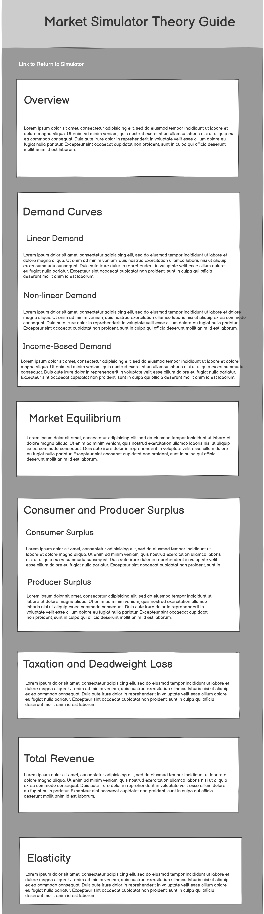  

Below is the wireframe for the supplementary theory page on mobile: 

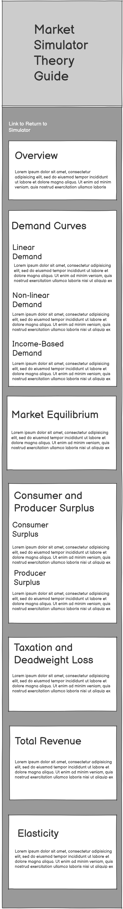 

The theory page was designed differently from the main application, prioritising **content readability rather than interaction**. The layout is intentionally linear, allowing users to scroll through structured sections covering key economic concepts.

---

## Features

Below is a comprehensive detailing of the features that users can explore while using the application.

### Main Market Graph

The main graph is the central feature of the application. It dynamically renders supply and demand curves using the HTML5 Canvas API, based on real-time parameter inputs.

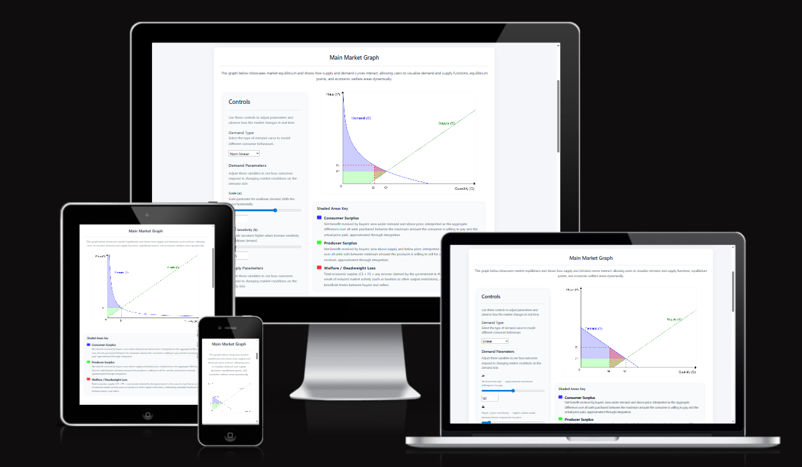

Meanwhile, graph itself is not pre-drawn or static. Instead, it is generated through mathematical functions that calculate values and convert them into pixel coordinates. This approach allows the application to support multiple demand models, including linear, nonlinear, and income-based demand, each of which produces a different curve shape and behaviour. 

The main graph section includes a control panel, which allows users to adjust parameters, alter the demand type and also features a reset section which allows users to reset demand and supply parameters as well as affording them the ability to return the simulator to its default state. As users adjust parameters such as intercepts, slopes, or taxation levels, the graph is recalculated and redrawn instantly. This ensures that the visual output remains fully synchronised with the underlying economic model, allowing users to observe how changes in inputs directly affect equilibrium, surplus, and overall market outcomes.

In addition to plotting curves, the graph also incorporates visual elements such as shaded surplus areas, equilibrium markers, and guide lines. These features help translate abstract calculations into clear visual representations, making it easier for users to interpret results without relying solely on numerical outputs.

---

### Revenue Graph and Presets

The revenue graph (which is displayed only in demand mode) adds a second layer of analysis to the application by showing how total revenue changes as output varies. Unlike the main market graph, which focuses on equilibrium, this graph allows users to explore firm behaviour and identify the output level at which revenue is maximised.

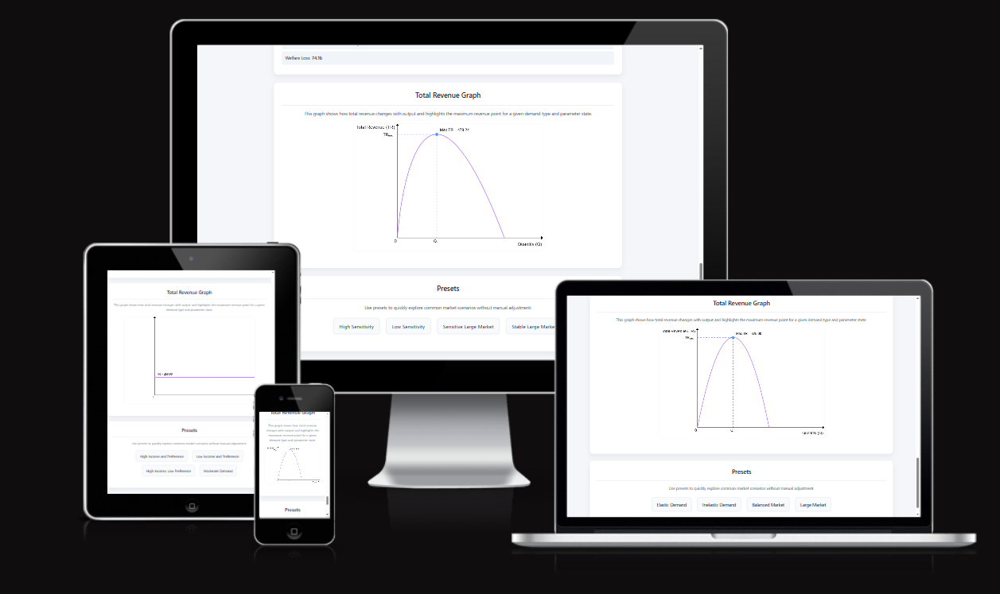

The revenue graph is generated directly from the active demand curve. For each quantity value, the corresponding price is calculated using the demand model before revenue is computed using TR = P × Q. Under linear demand, the curve follows a parabolic shape, increasing to a maximum before declining. For nonlinear demand, the curve adjusts according to the exponential relationship, while income-based demand produces constant revenue due to unit elasticity. This ensures the graph remains consistent with the underlying economic model.

The preset system is closely integrated with this graph and allows users to quickly switch between meaningful parameter configurations. Rather than manually adjusting multiple inputs, presets apply predefined values to the central state, instantly updating both the market and revenue graphs.

Presets vary depending on both the **selected demand type** and the **current mode of the application**. In demand mode, presets are designed to highlight differences such as elastic versus inelastic demand, as well as changes in intercepts and curve shapes. In supply mode, presets also include taxation, allowing users to observe how different combinations of demand conditions and tax levels affect revenue outcomes.

Because presets modify multiple variables at once, they are particularly useful for comparing scenarios. For example, users can quickly observe how revenue behaviour differs between elastic and inelastic demand, or how taxation impacts total revenue under different market conditions. This makes the preset system an important tool for structured experimentation rather than just convenience.

---

### Metrics and Insights (Responsive Layout)

The metrics panel presents key numerical outputs such as equilibrium price and quantity, while the insights panel provides contextual explanations that help interpret these results in economic terms.

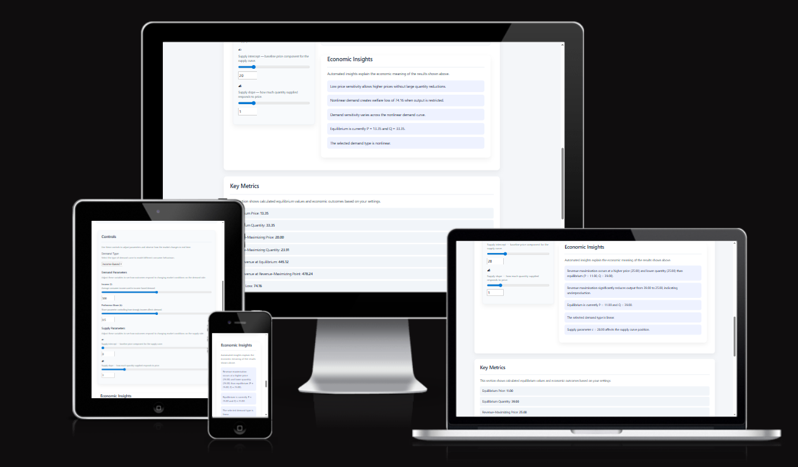

The inclusion of both quantitative and qualitative outputs ensures that users are not only able to observe changes in the model, but also understand their significance. The insights system translates variations in parameters into explanations related to elasticity, welfare effects, and market behaviour, reducing the need for prior theoretical knowledge.

The responsive behaviour shown in the image is deliberately selected to highlight differences across smaller screen sizes. On mobile devices, the layout already demonstrates how the insights section is positioned beneath the graph in a fully stacked format, ensuring readability and preserving the hierarchy of information.

To avoid repetition of this same stacked layout, the screenshot instead focuses on the tablet view, where the control panel is also visible. This allows the documentation to illustrate how controls are adapted at intermediate screen sizes without duplicating the mobile presentation. In this way, the image captures both the vertical stacking of interpretation elements on smaller screens and the transitional layout where interaction panels remain partially visible alongside outputs.

---

### Taxation and Supply Mode

Supply mode introduces taxation by shifting the supply curve upwards, creating a wedge between the price paid by consumers and the price received by producers.


The graph highlights both tax revenue and deadweight loss, allowing users to visually understand the inefficiencies created by market intervention. The reduction in equilibrium quantity, alongside the emergence of a deadweight loss area, demonstrates how taxation disrupts mutually beneficial trades between buyers and sellers.

The responsive display shown in the image also showcases different demand curve types across device layouts. Each screen presents a slightly different demand model, illustrating how taxation interacts with various demand conditions. For example, the impact of a given tax differs depending on whether demand is more elastic or inelastic, which is reflected in both the magnitude of the reduction in quantity and the size of the deadweight loss.

This variation reinforces an important economic insight: the burden and efficiency cost of taxation are not fixed, but depend on the underlying responsiveness of consumers. By combining taxation with multiple demand models, the application allows users to directly compare how different market conditions influence the outcomes of government intervention.

---

## Dark Mode

A fully integrated dark mode is included to improve usability in low-light environments and reduce eye strain. The colour palette was redesigned rather than simply inverted, ensuring that all elements — particularly canvas-rendered graphs — maintain clear contrast and readability.  

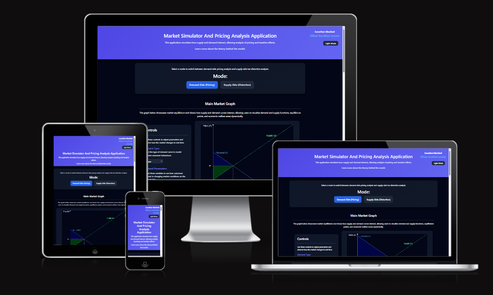

Special consideration was required for graph rendering, as canvas elements do not automatically inherit CSS styling. As a result, colours for curves, labels, and shading were dynamically adjusted to ensure visibility across both light and dark themes, while preserving consistent meaning. In particular, the standard light mode colour palette for the demand, supply and revenue curves and their labels was brightened significantly to increase contrast with the dark canvas background in dark mode, while the point guides used to indicate key prices and quantities was also given a brighter tone along with the axes and their labels.

### Theory Page

Now we turn our attention to the theory page, describing both its content and its layout which is presented in the following images.

The following view introduces the overall structure of the theory page, outlining the core concepts and establishing the foundation for understanding how demand is represented within the application.

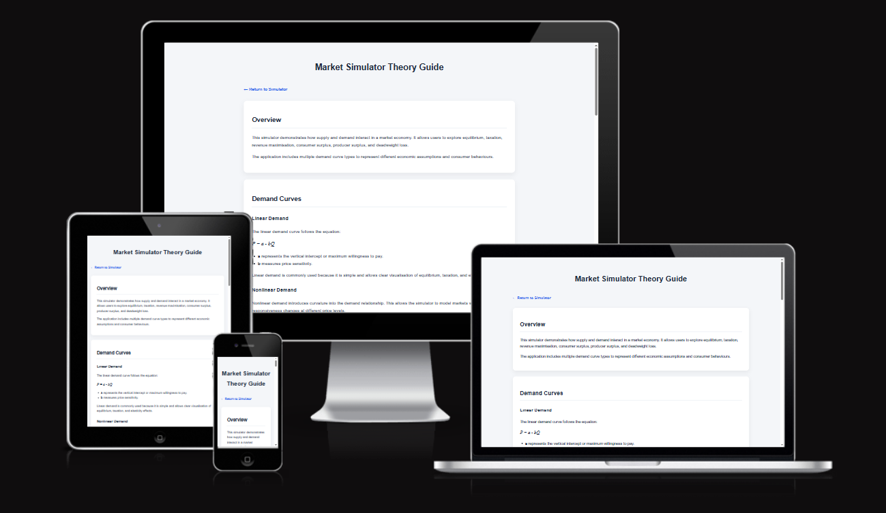

The section in the following image develops more advanced material, including income-based demand and its mathematical formulation, linking directly to the models implemented within the simulator

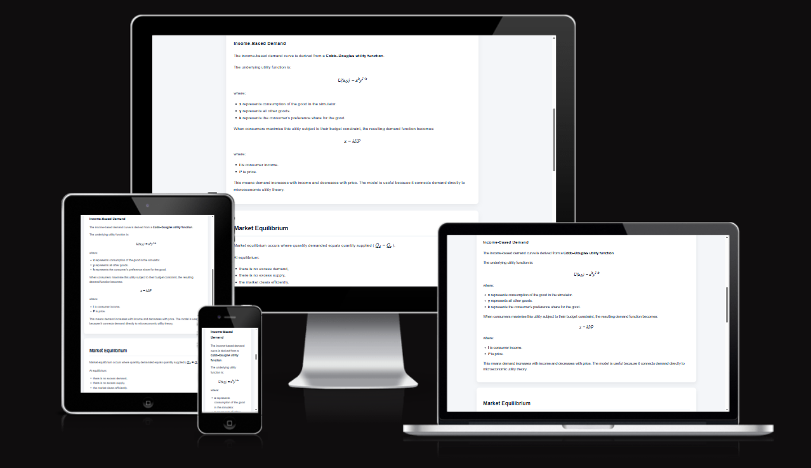

This view focuses on equilibrium and welfare analysis, explaining how consumer surplus, producer surplus, and market efficiency are determined and visualised in the application.

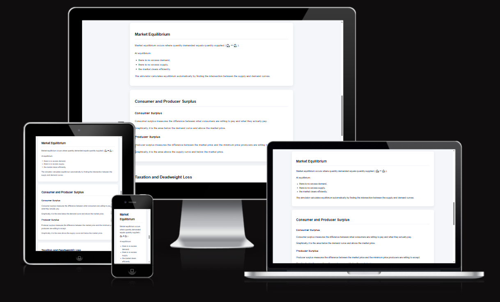 

This final section extends the analysis to taxation and market distortion, demonstrating how concepts such as deadweight loss and government intervention are introduced and connected to the supply-side functionality of the simulator.

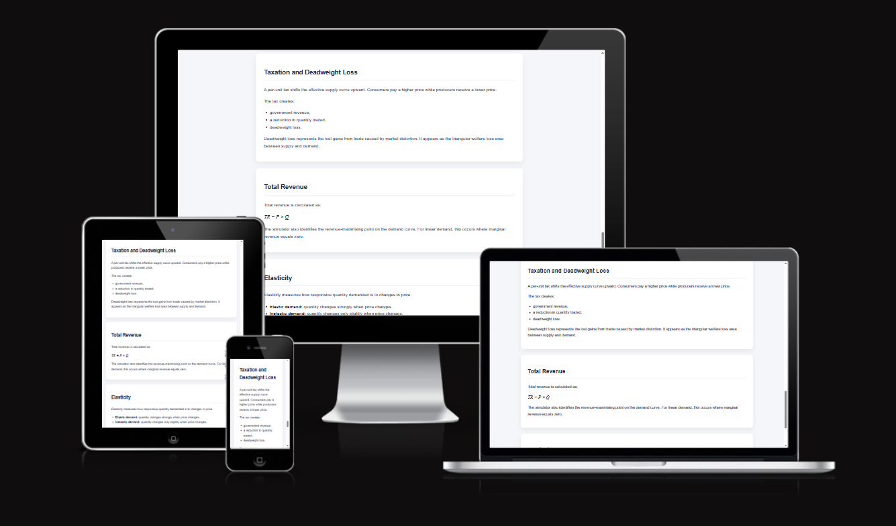

The theory page supports the application by providing structured explanations of key concepts, including demand models, equilibrium, and welfare.

It bridges the gap between the mathematical logic implemented in the application and the conceptual understanding required by users.

---

## JavaScript Application Architecture

The JavaScript implementation is built around a layered architecture where each level of the application depends on the level above it. Rather than treating graphs, metrics, insights, controls, and presets as separate features, the application uses a central state-driven system where changes propagate through the rest of the application automatically.

At a high level, the application follows this hierarchy:

```text
Mode
↓
Demand Type
↓
Parameters
↓
Calculations
↓
Metrics
↓
Graphs
↓
Insights
```

Almost every interaction follows the same update pipeline (with drawRevenue() only called if the app is in demand mode):

```js
displayAndStoreMetricValues();
drawCurves();
drawRevenue();
renderInsights();
```

The order is important. `displayAndStoreMetricValues()` must run first because it calculates and stores the market metrics used throughout the application. Both the graphing system and the insight generation system depend on these values being up to date.

### State Management

At the centre of the application is the `state` object, which acts as the application's memory.

```js
const state = {
    mode: "demand",
    demandType: "linear",
    a: 50,
    b: 1,
    aNonlinear: 50,
    bNonlinear: 0.2,
    income: 500,
    k: 0.5,
    c: 0,
    d: 1,
    t: 0
};
```

The state object stores all information required to recreate the current market scenario.

Rather than directly modifying graphs or metrics, event listeners update values inside `state`. The application then recalculates and redraws everything that depends on those values.

This ensures every part of the interface remains synchronised.

### Mode System

The first layer of the application is the mode system.

The mode buttons use HTML `data-mode` attributes:

```html
<button data-mode="demand">
<button data-mode="supply">
```

When a mode button is clicked:

```js
const newMode = e.currentTarget.dataset.mode;
state.mode = newMode;
```

This single value changes the behaviour of the entire application.

Demand mode focuses on:

- Equilibrium
- Revenue
- Elasticity
- Consumer and producer surplus

Supply mode focuses on:

- Taxation
- Tax incidence
- Tax revenue
- Deadweight loss

Mode switching also controls visibility throughout the interface.

Elements are grouped using classes such as:

```html
demand-only
supply-only
```

JavaScript simply adds or removes a `visible` class, allowing CSS to determine what should be shown on screen.

Many functions in the JavaScript also condition on the active mode, such as functions which retrieve the points needed for plotting after a user has interacted with the interface. For example the supply curve with tax is only drawn in supply mode. Similarly, some calculations only run and display in supply mode, such as any calculations related to tax.

### Demand Type System

Within each mode, users can select one of three demand models:

- Linear Demand
- Nonlinear Demand
- Income-Based Demand

The selected demand type is stored in:

```js
state.demandType
```

This value affects multiple systems simultaneously, including:

- Equilibrium calculations (the selected demand type determines which equilibrium function is called using if statements)
- Revenue calculations 
- Elasticity calculations 
- Welfare calculations
- Point generation (the selected demand type determines which functions generate the points used to plot demand curves, revenue curves, and welfare shading using if statements)
- Insight generation (rendered dynamically based not only on the demand type but also on the overall mode and other parameter values)

The application uses class naming conventions such as:

```html
demand-linear
demand-nonlinear
demand-income
```

to show only the controls relevant to the currently selected demand model. Visibility is once again controlled by CSS and JavaScript, with JavaScript adding an active class to elements with a given demand class when the user switches to the corresponding demand type and removing the active class from the previous demand type that has been switched away from, which is tracked using a variable called previousDemandType.

When switching demand type, the application also resets the parameters belonging to the previous demand model back to their defaults. This prevents users from returning to cluttered or unintended graph configurations when revisiting a demand model and ensures that each model begins from a predictable baseline.

A slightly different approach is used when switching between demand mode and supply mode. In this case, demand-side parameters are preserved, while supply-side parameters (including taxation) are reset to their default values. This design allows users to compare the same demand conditions across both modes without needing to re-enter demand parameters, while ensuring that taxes or supply adjustments from a previous supply-mode scenario do not unintentionally affect subsequent analysis.

### Dynamic Parameter Mapping

One recurring challenge throughout the application is keeping multiple interfaces synchronised with the same underlying value.

For example, the linear demand parameter `a` can be modified through:

- a slider (`id="a"`)
- a manual input (`id="aValue"`)
- preset buttons

All three controls ultimately modify the same variable:

```js
state.a
```

A naïve implementation would require separate update logic for every parameter:

```js
if (input.id === "aValue") {
    state.a = value;
}
else if (input.id === "bValue") {
    state.b = value;
}
else if (input.id === "incomeValue") {
    state.income = value;
}
else if (input.id === "kValue") {
    state.k = value;
}
```

As the application grew to support multiple demand models and additional parameters, this approach would have become increasingly repetitive and difficult to maintain.

Instead, the application uses a naming convention which closely mirrors the structure of the central state object.

The state contains properties such as:

```js
state.a
state.b
state.income
state.k
state.aNonlinear
state.bNonlinear
```

The manual inputs are then deliberately named:

```text
aValue
bValue
incomeValue
kValue
aNonlinearValue
bNonlinearValue
```

while the sliders are named:

```text
a
b
income
k
aNonlinear
bNonlinear
```

This allows JavaScript to determine which state property should be updated without needing parameter-specific logic.

For manual inputs, the application generates the correct state key dynamically:

```js
const key = input.id.replace("Value", "");
```

For example:

```text
aValue           → a
bValue           → b
incomeValue      → income
kValue           → k
aNonlinearValue  → aNonlinear
bNonlinearValue  → bNonlinear
```

The generated key can then be used directly:

```js
state[key] = value;
```

This means a single event handler can update every manual input in the application regardless of which demand model is currently active.

The sliders use an even simpler convention. Their ids are intentionally identical to the corresponding state properties:

```html
<input id="a">
<input id="b">
<input id="income">
<input id="k">
```

This means no key generation is required when synchronising sliders.

For example:

```js
slider.value = state[slider.id];
```

works because:

```text
slider.id = "a"
state["a"] = state.a

slider.id = "income"
state["income"] = state.income
```

The slider id can therefore be used directly as the state key.

This same pattern is reused throughout the application when synchronising controls after preset changes.

After a preset updates the state object, the application can refresh all controls generically:

```js
const key = input.id.replace("Value", "");
input.value = state[key];

slider.value = state[slider.id];
```

without needing separate logic for every parameter.

This significantly reduces code duplication and makes the application easier to extend. Adding a new parameter generally requires only:

1. Adding a property to the state object.
2. Creating a slider whose id matches that property.
3. Creating a manual input whose id follows the `Value` naming convention.

The existing synchronisation logic will then work automatically without requiring additional update code.

### Preset Visibility System

The application contains six distinct groups of preset buttons.

These arise from the combination of:

- Two application modes
  - Demand Mode
  - Supply Mode

and

- Three demand models
  - Linear Demand
  - Nonlinear Demand
  - Income-Based Demand

This creates six possible interface states:

```text
Demand + Linear
Demand + Nonlinear
Demand + Income

Supply + Linear
Supply + Nonlinear
Supply + Income
```

Each state has its own set of preset configurations designed to demonstrate meaningful economic scenarios for that particular combination of mode and demand model.

Rather than manually showing and hiding individual preset buttons through JavaScript, the application uses a nested HTML structure combined with CSS class conventions.

The outer container conditions on the application's overall mode:

```html
<div class="demand-mode">
```

or

```html
<div class="supply-mode">
```

while an inner container conditions on the currently selected demand type:

```html
<div class="demand-linear">
```

```html
<div class="demand-nonlinear">
```

```html
<div class="demand-income">
```

This creates a hierarchy where visibility depends on both pieces of application state simultaneously.

For example:

```text
Supply Mode
↓
Nonlinear Demand
↓
Supply + Nonlinear Presets
```

When the user switches mode, JavaScript updates which mode containers are active. When the user changes demand type, JavaScript updates which demand-type containers are active.

Because preset groups are nested inside both containers, only the preset group matching the current combination of mode and demand type becomes visible.

This approach keeps the JavaScript simple while allowing the interface to adapt automatically to the application's current state.

### Economic Calculations

The application's main calculation hub is:

```js
displayAndStoreMetricValues();
```

This function calculates all economic values required by the rest of the application and conditions the calculations on the demand type and the mode (demand or supply). This includes:

- Equilibrium price
- Equilibrium quantity
- Revenue-maximising price
- Revenue-maximising quantity
- Consumer surplus
- Producer surplus
- Total revenue
- Elasticity
- Tax revenue
- Deadweight loss

The results are stored in:

```js
currentMetrics
```

which acts as a central cache for the graphing and insight systems. For example, the welfare shading functions trace the outer boundaries of surplus regions using loops. These boundaries depend on values such as equilibrium quantity and equilibrium price, which change whenever the user adjusts parameters. Storing these values in `currentMetrics` allows the graphing and shading systems to reuse them without recalculating them repeatedly.

### Main Graph Rendering

The main market graph is rendered through:

```js
drawCurves();
```

This function acts as an orchestrator rather than containing all graphing logic itself.

Before any curves are drawn, the application must determine which curves are required:

```js
retrievePointsNeededForPlotting(
    state.mode,
    state.demandType
);
```

Depending on the active mode, this may include:

- Demand curve
- Supply curve
- Tax-adjusted supply curve

The function then:

1. Clears the canvas.
2. Draws the axes.
3. Draws welfare shading.
4. Draws supply and demand curves.
5. Draws labels and equilibrium markers.

The graph itself is rendered using the Canvas API, meaning economic coordinates must be converted into screen coordinates before being drawn.

### Welfare Shading

The application separates welfare shading from curve plotting.

In demand mode:

```js
drawDemandModeShading();
```

is used.

In supply mode:

```js
drawSupplyModeShading();
```

is used.

These functions use values stored in `currentMetrics` to determine the coordinates of:

- Consumer surplus
- Producer surplus
- Tax revenue
- Deadweight loss

The shaded regions are drawn before the curves so that the curves remain clearly visible on top.

### Revenue Graph

The revenue graph is rendered independently of the main market graph and is only implemented when the mode is set to demand.

Different point-generation functions are used depending on the active demand type:

```js
generatePlotPointsRevenueLinear()
generatePlotPointsRevenueNonlinear()
generatePlotPointsRevenueIncome()
```

Each function calculates revenue values using:

```text
TR = P × Q
```

and returns a set of points which can be plotted on the revenue canvas.

For linear and nonlinear demand, separate functions are also used to calculate the revenue-maximising quantity and revenue-maximising revenue level (revenue is constant in the income case so such a point does not exist), which are then highlighted on the graph.

### Hover System

The application includes hover functionality on both canvases.

For the main graph the following function orchestrates the sequence of events set off by the hover event:

```js
handleMouseMove()
```

It works by using helper functions to convert the mouse's pixel position back into an economic quantity triggered by a mousemove event on the relevant canvas. This quantity is then used to calculate the corresponding price, elasticity, or revenue before a temporary overlay is drawn onto the canvas using:

```js
drawHoverOverlay()
```

which redraws the graph and overlays the hover marker and elasticity label.

For the revenue graph:

```js
handleRevenueMouseMove()
```

implements a similar pipeline, calculating the revenue value corresponding to the mouse position and calls:

```js
drawRevenueOverlay()
```

which overlays a marker showing the current total revenue at the selected quantity.

This allows users to explore the model interactively without permanently altering the graphs. The functions which draw the hover overlay on a mouse movement must also redraw the entire canvas every time an event fires in order to remove the previous overlay from the canvas ready to add the next one. Similarly there is a separate set of functions which redraw the canvas when the mouseleave event fires and the cursor leaves the canvas to get rid of any residual overlays generated by a mousemove event.

### Insight Generation

The final layer of the application is the insights system.

Insights are generated through:

```js
renderInsights();
```

which uses both:

```js
state
currentMetrics
```

to generate explanations of the current market situation.

Rather than simply displaying numbers, the insights interpret those numbers and explain their economic significance.

The system first attempts to generate scenario-specific insights and then fills any remaining spaces using fallback insights to ensure a consistent number of insights (five) are always displayed.

### Preset System

The preset system allows multiple parameters to be changed simultaneously.

Each preset button has a data attribute. When a preset button is clicked:

```js
changeParametersPreset(preset);
```

the function reads this attribute and updates the relevant state values accordingly.

The application then synchronises all sliders and manual inputs with the updated state:

```js
const key = input.id.replace("Value", "");
input.value = state[key];
```

This ensures the controls always reflect the underlying model configuration after a preset has been applied.

### Dark Mode Implementation

The application includes a dark mode which is implemented using class-based theme switching.

Rather than individually applying dark mode styles to every element through JavaScript, the application toggles a single class on the document body:

```js
document.body.classList.toggle("dark-mode");
```

This approach allows JavaScript to remain simple while CSS handles the visual styling.

For example, when the `dark-mode` class is present on the body element:

```css
body.dark-mode .card {
    background-color: #1f2937;
}

body.dark-mode .controls-container {
    background-color: #111827;
}
```

All descendant elements automatically inherit the appropriate dark mode styling through CSS selectors.

This means JavaScript only needs to add or remove a single class regardless of how many elements require theme-specific styling.

The theme toggle also updates the button text to indicate the currently available mode:

```js
darkModeToggle.textContent =
    isDark ? "Light Mode" : "Dark Mode";
```
where isDark is a boolean which checks if the body element currently contains a dark mode class. If it does then the app is in dark mode, the boolean takes a true value which changes the text content on the button to "Light Mode" and vice versa when the app is in its default "Light Mode". 

This implementation separates behaviour from presentation, with JavaScript controlling application state and CSS controlling visual appearance.

### Session Storage for Theme Persistence

The application uses `sessionStorage` to preserve the selected theme when users navigate between the simulator and theory pages.

When the dark mode button is pressed, the current theme is stored using:

```js
sessionStorage.setItem("theme", isDark ? "dark" : "light");
```

Both pages then call the `applyThemeFromSession()` function when they load:

```js
function applyThemeFromSession() {
    const savedTheme = sessionStorage.getItem("theme");

    if (savedTheme === "dark") {
        document.body.classList.add("dark-mode");
        darkModeToggle.textContent = "Light Mode";
    } else {
        document.body.classList.remove("dark-mode");
        darkModeToggle.textContent = "Dark Mode";
    }
}
```

This function retrieves the previously selected theme from session storage and applies the corresponding CSS class to the `<body>` element. It also updates the button text so that it reflects the currently available theme option.

By calling this function on page load, both the simulator and theory pages automatically restore the user's chosen theme whenever navigation occurs between pages.

Unlike `localStorage`, which persists indefinitely until explicitly cleared, `sessionStorage` only lasts for the lifetime of the browser tab. This means the selected theme is maintained throughout a browsing session but automatically resets when the tab or browser is closed.

This behaviour was chosen because it provides a consistent user experience across the application while ensuring that each new session begins with the default appearance.

### Canvas Theme Handling

The Canvas API differs from standard HTML elements because canvases do not automatically respond to CSS theme changes once content has been drawn.

As a result, the graph canvases require separate theme handling.

The application uses a helper function:

```js
getCanvasTheme()
```

which determines the appropriate colours for the current theme.

This function returns values such as:

- axis colours
- text colours
- grid colours
- curve colours
- shading colours

in an object data structure. The graph rendering functions then retrieve these colours before drawing:

```js
const theme = getCanvasTheme();
```

Because canvas graphics are drawn directly as pixels, changing theme requires the canvases to be completely redrawn using the new colour palette.

For this reason, switching theme triggers:

```js
displayAndStoreMetricValues();
drawCurves();
drawRevenue();
renderInsights();
```

This ensures both canvases are regenerated using the correct dark mode or light mode styling.

The combination of body-level CSS theming and canvas-specific theme generation allows the application to maintain a consistent appearance across both standard HTML elements and dynamically rendered graphics.

### Overall Flow

Every user interaction ultimately follows the same dependency chain:

```text
User Interaction
↓
State Update
↓
displayAndStoreMetricValues() runs

(calculates the relevant economic metrics by conditioning on
the current state and calling helper functions, then updates
the metric displays)

↓
currentMetrics is updated inside the displayAndStoreMetricVales() function

(stores the latest calculated values for reuse throughout
the application)

↓
drawCurves() runs

(draws the required curves which are retrieved using helper functions and welfare shading based on the current state and metrics)

drawRevenue() runs if state.mode === "demand"

(generates and plots the revenue curve)

renderInsights() runs

(generates insights based on the current state and metrics)

(All three functions depend on the state object and
currentMetrics being up to date.)
```

This architecture ensures that all components of the application remain synchronised and accurately reflect the current market scenario, regardless of which control the user interacts with.

## Challenges Encountered

The development of this application presented a range of technical challenges, primarily due to the number of interconnected systems and the need to maintain consistency across all user interactions. The application is not composed of isolated components; instead, every element is linked through a shared state, meaning that even small interactions trigger wide-ranging updates.

---

### Full Application Update Cycle

One of the most significant challenges was managing the fact that the entire application must update whenever a user interacts with it. Any change — whether adjusting a slider, entering a value manually, switching demand type, or changing mode — requires a full recalculation and redraw of:

- the main market graph  
- the revenue graph  
- all calculated metrics  
- the insights panel  

This creates a dependency chain where every interaction must correctly propagate through the system. If any part of this update sequence fails or is out of sync, the application produces inconsistent or incorrect results.

Ensuring that all components updated in the correct order and remained synchronised required careful structuring of the update logic and repeated debugging.

---

### Managing Multiple Application States

The application operates across several overlapping states, including:

- demand vs supply mode  
- three different demand models  
- taxation levels  
- preset configurations  

Each of these states influences how calculations are performed and how graphs are rendered. For example, switching demand types changes the underlying mathematical model, while switching to supply mode introduces taxation and additional calculations.

Handling transitions between these states was particularly challenging, as logic that worked in one configuration could fail in another. This required extensive conditional handling and careful separation of logic for each scenario.

---

### Synchronisation of Inputs

Another major challenge was ensuring that all user inputs remained synchronised. The application allows variables to be changed through:

- range sliders  
- number input fields  
- preset buttons  

All of these inputs modify the same underlying variables in the application state. This creates the risk of desynchronisation, where one input updates but others do not reflect the change.

To address this, each input is tightly linked to the central state, and every update triggers a refresh across all related inputs. This ensures that sliders, number fields, and presets remain consistent at all times, but required precise event handling and careful debugging.

---

### Canvas Rendering and Scaling

Rendering graphs using the Canvas API introduced significant complexity, as all drawing operations had to be implemented manually. This included:

- converting mathematical functions into coordinate points  
- scaling values to fit within the canvas  
- redrawing curves dynamically as parameters change  

Unlike using a charting library, there was no abstraction layer to handle these tasks automatically. Small errors in scaling or coordinate mapping could lead to visibly incorrect graphs, making this one of the most technically demanding aspects of the project. A pre-built graphing package could have been chosen to make implementation easier but the smoothness of transition between states may have been compromised and the canvas API which gives the user control over every pixel allowed greater flexibility for complex plots even if it required a lot of technically demanding manual work.

---

### Handling Edge Cases

Certain parameter combinations introduced edge cases that could break the application or produce invalid graphs. Examples included:

- extremely steep or near-vertical curves  
- zero or near-zero prices  
- very large or very small parameter values  

These cases required additional conditional logic to ensure stability and prevent rendering errors.

---

### Dark Mode and Canvas Rendering

Implementing dark mode introduced additional challenges, particularly because canvas elements do not inherit CSS styles. All colours used within the graphs had to be manually adjusted to ensure they remained visible against darker backgrounds.

This required duplicating certain rendering logic and carefully testing contrast across both light and dark modes.

---

Overall, the primary challenge of the project was not implementing individual features, but ensuring that all features remained consistent and synchronised within a highly interactive, state-driven system. The complexity arose from how each component depended on every other component, requiring careful coordination of logic, rendering, and user interaction.

---

## AI Tool Usage and Reflection

Artificial intelligence tools were used throughout the development process to support problem solving, particularly in areas where there was no prior experience. One of the most significant examples of this was the implementation of canvas-based graph rendering, which introduced a completely new set of challenges compared to standard DOM-based development.

At the start of the project, there was no prior experience with the HTML5 Canvas API or with translating mathematical functions into graphical output. Concepts such as coordinate mapping, scaling functions to fit a fixed canvas, and dynamically redrawing curves in response to user interaction required a different approach to problem solving. AI was used in this context to help break down these unfamiliar problems into manageable steps, suggest approaches to mapping values to pixels, and identify potential sources of error when graphs were not rendering correctly.

However, AI output was rarely used directly. In many cases, suggestions needed to be critically evaluated, simplified, or significantly modified to fit the structure of the application. This was particularly true when dealing with the interaction between multiple systems, such as ensuring that canvas rendering remained consistent with the central state object and updated correctly when parameters changed.

The collaborative process highlighted the importance of understanding, rather than simply applying, generated solutions. AI often provided a starting point or a direction, but achieving a working implementation required manual refinement and testing. In some cases, suggested approaches did not integrate well with the existing codebase and had to be reworked or discarded entirely.

AI was also particularly useful when implementing dark mode, especially for canvas-based elements. Unlike standard HTML components, canvas content does not automatically adapt to CSS theme changes. AI helped identify the need to manually update drawing styles (such as line colours, gridlines, and text) based on the current theme state. It also assisted in structuring logic to ensure that graphs were fully re-rendered when switching between light and dark mode, maintaining visual consistency and readability across themes.

In addition, AI supported the integration of the weather API, which introduced asynchronous data fetching and external data handling. Guidance was used to structure API requests, process JSON responses, and safely update the UI with live data. As with other areas of the project, the initial implementations required refinement to ensure they aligned with the application’s structure and handled potential errors effectively.

This process was especially valuable in developing an understanding of canvas rendering logic. By working through suggestions, debugging issues, and adapting solutions, it was possible to build a functioning system that accurately represents economic models visually. This represents a significant progression from having no initial experience with canvas to implementing a fully dynamic graphing system.

Overall, AI functioned as a support tool for exploration and debugging rather than a replacement for problem solving. The final application reflects independently implemented logic, with AI contributing primarily to accelerating the learning process and helping navigate unfamiliar technical challenges.
 
 ---

## Future Improvements

While the application is fully functional, there are several areas where it could be extended or refined to improve both maintainability and user experience.

One potential improvement is the modularisation of the JavaScript codebase. At present, most logic is contained within a single file, which makes it harder to manage as complexity increases. Separating functionality into smaller, focused modules (for example, graph rendering, state management, and insights generation) would improve readability, maintainability, and scalability.

The addition of animation could further enhance the user experience. Currently, changes to graphs occur instantly, which prioritises responsiveness but can feel abrupt. Introducing smooth transitions when parameters change would make the behaviour of curves and equilibrium points easier to follow visually.

Expanding the range of economic models would also add depth to the application. While multiple demand models are already supported, further extensions could include more advanced supply models or additional market structures, allowing for a broader exploration of economic theory.

Finally, accessibility improvements could be made to ensure the application is usable by a wider range of users. This could include enhancements such as improved keyboard navigation, more detailed labels for screen readers, and further refinement of contrast levels, particularly within the canvas-rendered graphs.
 
---

## Technologies Used

- HTML5  
- CSS3  
- JavaScript  
- Bootstrap  
- Canvas API  

---

## Accessibility

- Clear visual contrast between elements, including support for dark mode
- Semantic HTML structure to improve readability and assistive technology support  
- Responsive layout ensuring usability across desktop, tablet, and mobile devices  
- Labels and structured controls to make user inputs clear

## Testing

Full testing and validation results can be found in the [TESTING.md](TESTING.md) file.

---

## Deployment

The project was deployed using **GitHub Pages** from the main branch.

---

## Credits

- Color palette generated using Coolors 
- Wireframes generated manually using Balsamiq  
- Open-Meteo API was used to retrieve real-time weather data via geolocation 
- Microsoft Copilot Chat was used as a supporting development tool for debugging and exploring solutions
- Visual Studio Code was used as the primary development environment
