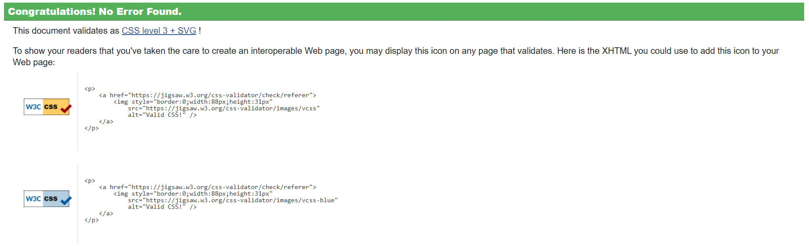
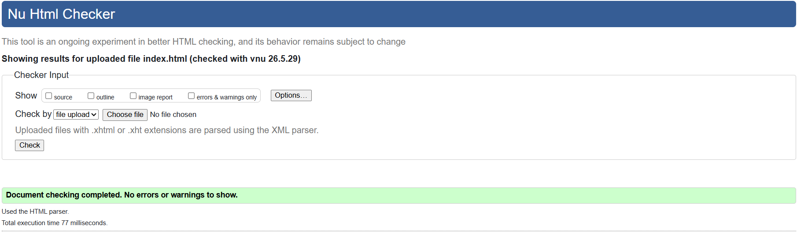
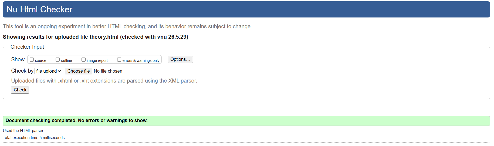
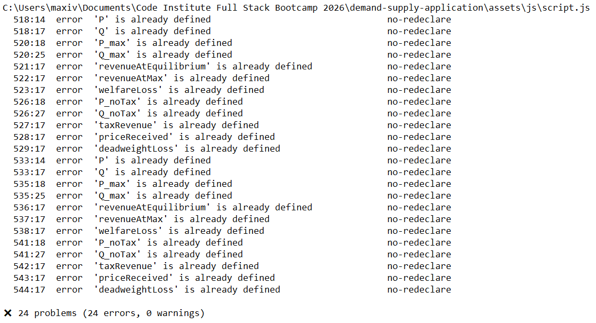
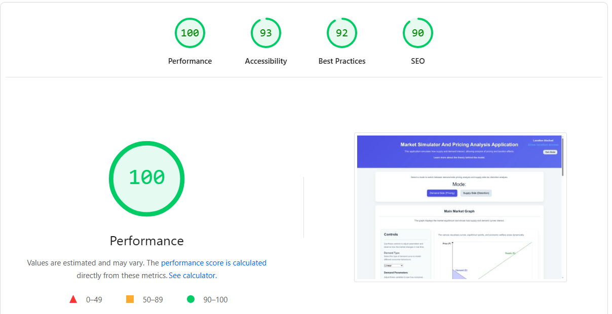
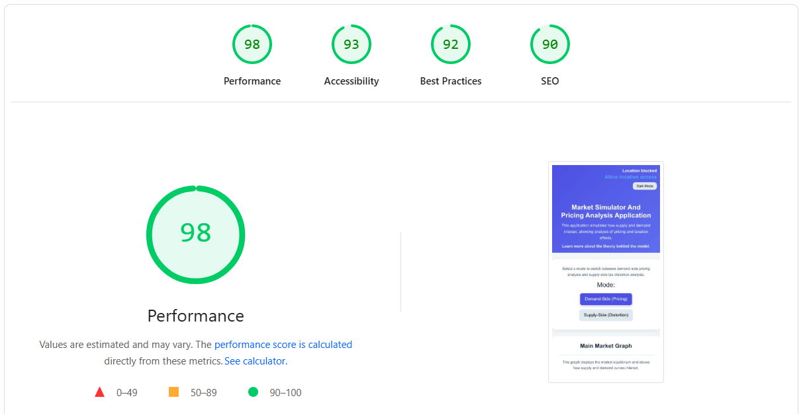
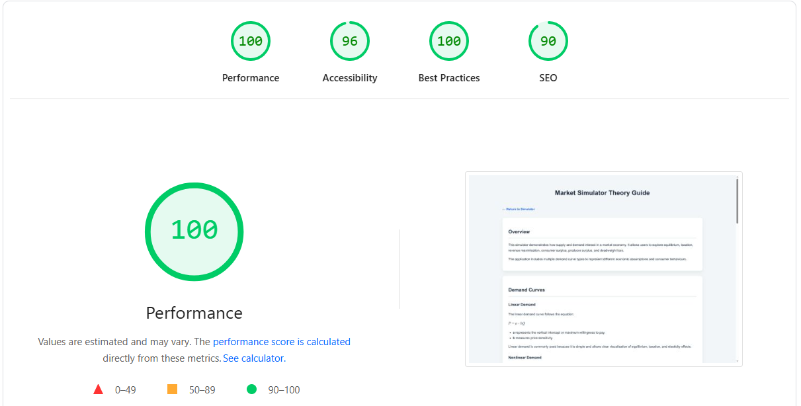
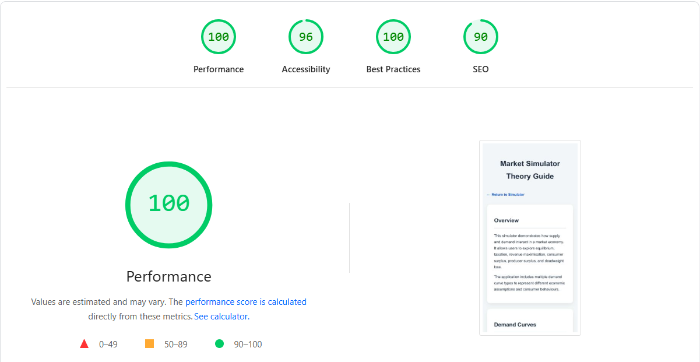

## Table of Contents

- [Testing and Validation](#testing-and-validation)
- [CSS Validation](#css-validation)
- [HTML Validation](#html-validation)
- [JavaScript Validation](#javascript-validation)
  - [ESLint Results and Justification](#eslint-results-and-justification)
- [Lighthouse Validation](#lighthouse-validation)
  - [Lighthouse Score Reference](#lighthouse-score-reference)
  - [Lighthouse Results Summary](#lighthouse-results-summary)
    - [Main Simulator Page](#main-simulator-page)
      - [Desktop](#desktop)
      - [Mobile](#mobile)
    - [Theory Page](#theory-page)
      - [Desktop (Theory)](#desktop-theory)
      - [Mobile (Theory)](#mobile-theory)
- [Functional Testing](#functional-testing)
- [Responsive Testing](#responsive-testing)
- [Performance Considerations and Impact](#performance-considerations-and-impact)
- [Conclusion](#conclusion)

# Testing and Validation

This document outlines the testing and validation processes carried out for the **Market Simulator and Pricing Analysis Application**.  

Testing was conducted throughout development to ensure that all components of the application function correctly, remain synchronised across interactions, and meet modern web standards.  

The testing process included:

- HTML and CSS validation  
- JavaScript validation using ESLint  
- Lighthouse performance, accessibility, and SEO analysis  
- Functional and responsive testing across the application  

---

## CSS Validation

CSS validation was conducted using the **W3C CSS Validation Service** to ensure that stylesheets follow current standards and contain no errors.

The application uses two different CSS approaches:

- an **external stylesheet** for the main application (`index.html`)  
- an **internal stylesheet** for the `theory.html` page  

Both were validated individually.

**CSS Validation Results:**
- No errors found in either stylesheet  

The following image shows validation results for the external stylesheet used in the main simulator page:

  

The following image shows validation results for the internal stylesheet used in the theory page:

  

These results confirm that the styling across both pages is syntactically valid and adheres to CSS Level 3 standards.

---

## HTML Validation

HTML validation was carried out using the **W3C Nu HTML Checker**.

Both pages within the application were tested individually:

- `index.html` (main simulator)  
- `theory.html` (supporting theory page)  

Each page returned a clean validation result with no errors or warnings.

The following image shows validation results for the main simulator page (`index.html`):

  

The following image shows validation results for the theory page (`theory.html`):

  

Achieving a clean validation ensures:

- correct semantic structure  
- improved accessibility  
- compatibility across modern browsers   

---

## JavaScript Validation

### ESLint Results and Justification

ESLint was used to review the JavaScript codebase and identify potential issues such as syntax errors, unused variables, and redeclarations.

When running ESLint, several warnings and errors were reported relating to variable redeclaration inside the `displayAndStoreMetricValues()` function. These included variables such as:

- `P`, `Q`, `P_max`, `Q_max`  
- `revenueAtEquilibrium`, `revenueAtMax`  
- `welfareLoss`, `taxRevenue`, `deadweightLoss`  

These warnings occur because the function uses `var` declarations within conditional branches to handle different demand types and application modes.

Although flagged by ESLint, these do not produce runtime errors. This is because `var` is function-scoped in JavaScript, meaning redeclarations within separate conditional blocks are hoisted and interpreted as a single variable declaration.

This structure is intentional. The function must calculate different values depending on:

- selected demand model  
- whether the application is in demand or supply mode  
- whether taxation is applied  

These variables are later used to update the metrics panel and stored in the central state object, requiring them to remain accessible throughout the function.

The application was tested extensively after these warnings, and all features continued to operate correctly, including:

- dynamic graph rendering  
- revenue calculations  
- taxation modelling  
- insights generation  
- dark mode redraw behaviour  

Other ESLint issues (such as unused variables or unnecessary parameters) were resolved. The remaining redeclaration warnings are therefore considered acceptable as they reflect intentional design choices rather than faulty logic.

---

## Lighthouse Validation

Lighthouse testing was conducted using **Chrome DevTools** to evaluate:

- Performance  
- Accessibility  
- Best Practices  
- SEO  

Testing was performed in both **desktop and mobile modes** to reflect real-world usage.

---

### Lighthouse Score Reference

| Category | Score Range | Indicator | Explanation |
|----------|-----------|----------|-------------|
| Performance | 90–100 | 🟢 | Fast and optimised |
| Accessibility | 90–100 | 🟢 | Accessible to most users |
| Best Practices | 90–100 | 🟢 | Follows modern standards |
| SEO | 90–100 | 🟢 | Good search visibility |

---

## Lighthouse Results Summary

The following sections present the Lighthouse testing results for both the main simulator and the theory page. Testing was conducted in both desktop and mobile modes to reflect real-world conditions and to evaluate performance, accessibility, best practices, and SEO across devices.

---

### Main Simulator Page

The results below summarise the Lighthouse testing outcomes for the interactive simulator, which includes real-time graph rendering and state-driven updates.

#### Desktop

The following results show the Lighthouse analysis for the main simulator when tested in desktop mode.

- Performance: 100  
- Accessibility: 93  
- Best Practices: 92  
- SEO: 90  

The simulator performs strongly on desktop despite its real-time graph rendering and continuous state updates, with only minor reductions in accessibility and best practices due to the use of canvas-based elements.

---

#### Mobile

The following results show the Lighthouse analysis for the main simulator under mobile testing conditions.

- Performance: 98  
- Accessibility: 93  
- Best Practices: 92  
- SEO: 90  

Performance remains consistently high on mobile, with only a small reduction due to simulated device constraints, demonstrating that responsiveness has been implemented effectively.

---

### Theory Page

The results below summarise Lighthouse testing for the theory page, which is primarily content-based and less dependent on complex JavaScript interactions.

#### Desktop

The following results show the Lighthouse analysis for the theory page in desktop mode.

- Performance: 100  
- Accessibility: 96  
- Best Practices: 100  
- SEO: 90  

As the theory page is primarily content-based and does not rely on complex JavaScript interactions, it achieves near-perfect scores across all categories.

---

#### Mobile

The following results show the Lighthouse analysis for the theory page under mobile testing conditions.

- Performance: 100  
- Accessibility: 96  
- Best Practices: 100  
- SEO: 90  

The results remain unchanged on mobile, confirming that the page maintains strong performance and readability across all device sizes.

## Functional Testing

Functional testing focused on verifying that all interactive components behave correctly across all states of the application.

This included testing:

- parameter adjustments via sliders and inputs  
- switching between demand types  
- switching between demand and supply modes  
- preset behaviour  
- taxation effects  
- revenue graph updates  
- insights generation  

A key aspect of testing involved ensuring that all components remain synchronised, as every interaction triggers a full update cycle across graphs, metrics, and insights.

All tested features behaved as expected, and no functional inconsistencies were observed during testing.

---

## Responsive Testing

Responsive testing was conducted across desktop, tablet, and mobile screen sizes.

Key observations:

- desktop layout supports side-by-side interaction between graph and controls  
- tablet layout begins transitioning into a vertically stacked structure  
- mobile layout prioritises the graph with stacked controls and insights  

Special attention was given to:

- correct scaling of canvas elements  
- usability of sliders on touch devices  
- stacking behaviour of insights and controls  

The application remained fully functional across all screen sizes, with no loss of interactivity.

---

## Performance Considerations and Impact

Performance testing focused on balancing **real-time interactivity with efficient execution**.

One of the main contributors to runtime complexity is the application’s reactive structure, where every interaction triggers:

- recalculation of economic values  
- full graph redraw using canvas  
- metrics and insights updates  

While this increases computational workload, it ensures immediate feedback, which is essential for usability.

Lighthouse performance scores remained high, indicating that the implementation remains efficient despite the complexity of interactions.

It is also important to note that **measured performance does not always reflect perceived performance**. The application prioritises smooth interaction and immediate response over minimising computation.

---

## Conclusion

All validation and testing processes were completed successfully.

- HTML and CSS validated with no errors  
- JavaScript issues were reviewed and justified  
- Lighthouse results demonstrate strong performance and accessibility  
- Functional and responsive testing confirmed consistent behaviour  

Overall, the application meets modern web standards and performs reliably across devices, with all major features operating as intended.
